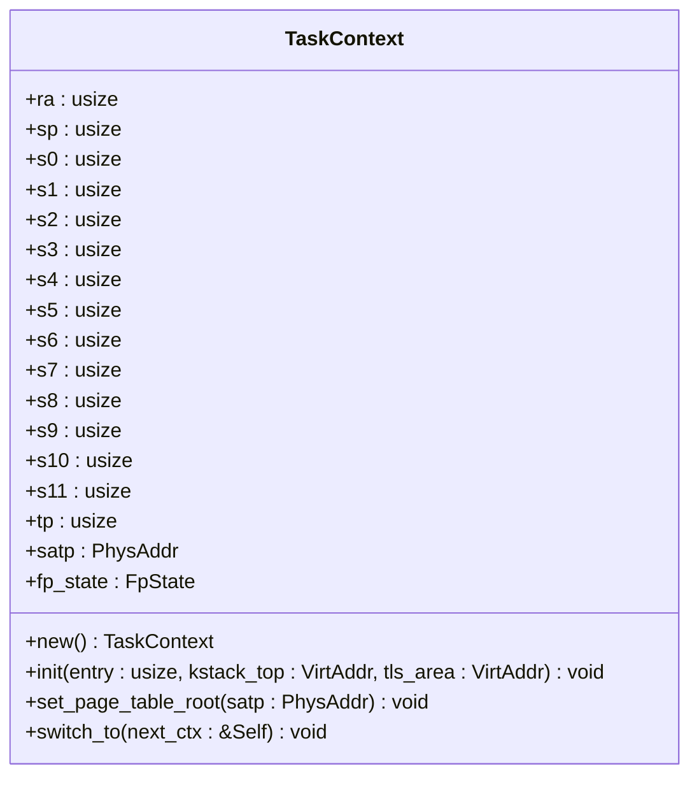
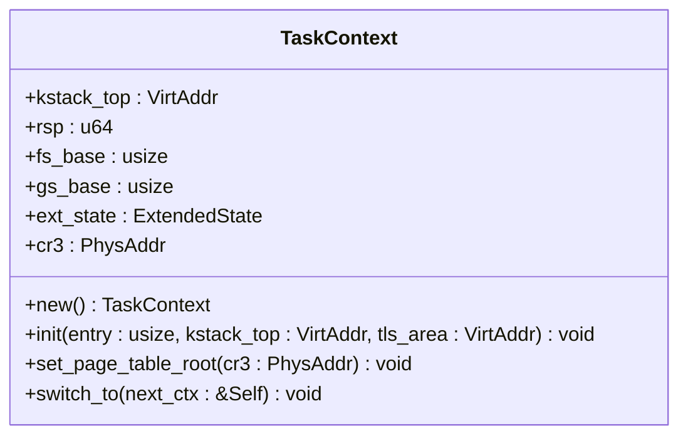
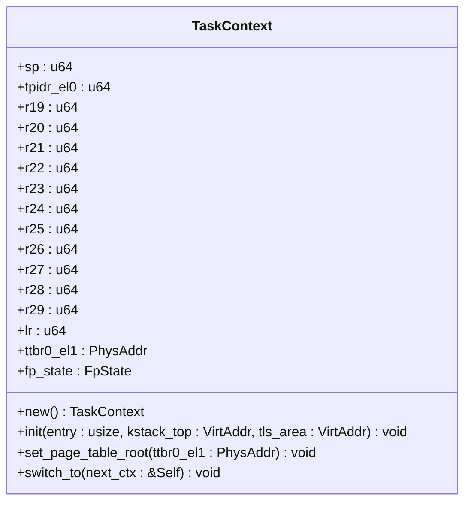
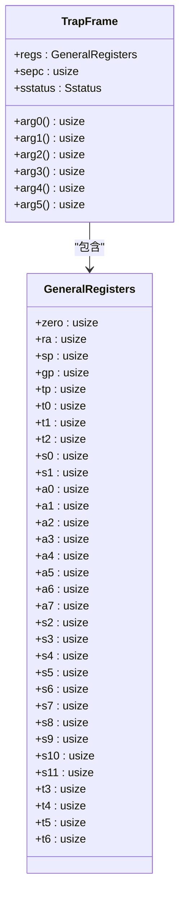

# API 参考手册

<cite>
**Referenced Files in This Document**   
- [TaskContext](file://src/riscv/context.rs#L136-L193)
- [TrapFrame](file://src/riscv/context.rs#L97-L140)
- [init_trap](file://src/riscv/init.rs#L5-L13)
- [switch_to](file://src/riscv/context.rs#L187-L229)
- [TaskContext](file://src/x86_64/context.rs#L151-L187)
- [TrapFrame](file://src/x86_64/context.rs#L0-L62)
- [init_trap](file://src/x86_64/init.rs#L32-L38)
- [switch_to](file://src/x86_64/context.rs#L215-L254)
- [TaskContext](file://src/aarch64/context.rs#L96-L141)
- [TrapFrame](file://src/aarch64/context.rs#L0-L48)
- [init_trap](file://src/aarch64/init.rs#L100-L109)
- [switch_to](file://src/aarch64/context.rs#L187-L229)
- [init_trap](file://src/loongarch64/init.rs#L41-L49)
</cite>

## 目录
1. [简介](#简介)
2. [核心结构体](#核心结构体)
   - [TaskContext](#taskcontext)
   - [TrapFrame](#trapframe)
3. [核心函数](#核心函数)
   - [init_trap](#init_trap)
   - [switch_to](#switch_to)
4. [跨架构一致性分析](#跨架构一致性分析)

## 简介

本API参考手册详细描述了axcpu项目中的核心公共接口，包括`TaskContext`、`TrapFrame`、`init_trap`和`switch_to`等关键组件。这些接口在RISC-V、x86_64、AArch64和LoongArch64四种不同架构上实现了统一的抽象层，为操作系统内核提供任务上下文切换和中断处理的基础支持。文档将逐一解析每个API元素的签名、参数、返回值及使用约束，并特别标注unsafe代码的安全边界条件。

## 核心结构体

### TaskContext

`TaskContext`结构体用于保存任务的硬件状态，包括被调用者保存寄存器、栈指针、线程指针以及浮点/SIMD寄存器等。在任务切换时，当前任务将其上下文从CPU保存到内存，下一个任务则从内存恢复其上下文到CPU。

**Section sources**
- [src/riscv/context.rs](file://src/riscv/context.rs#L136-L193)
- [src/x86_64/context.rs](file://src/x86_64/context.rs#L151-L187)
- [src/aarch64/context.rs](file://src/aarch64/context.rs#L96-L141)

#### RISC-V 架构实现



**Diagram sources**
- [src/riscv/context.rs](file://src/riscv/context.rs#L136-L193)

#### x86_64 架构实现



**Diagram sources**
- [src/x86_64/context.rs](file://src/x86_64/context.rs#L151-L187)

#### AArch64 架构实现



**Diagram sources**
- [src/aarch64/context.rs](file://src/aarch64/context.rs#L96-L141)

### TrapFrame

`TrapFrame`结构体用于保存发生陷阱（中断或异常）时的寄存器状态。它包含了所有通用寄存器、异常程序计数器和状态寄存器，是系统进行中断处理和系统调用的基础数据结构。

**Section sources**
- [src/riscv/context.rs](file://src/riscv/context.rs#L97-L140)
- [src/x86_64/context.rs](file://src/x86_64/context.rs#L0-L62)
- [src/aarch64/context.rs](file://src/aarch64/context.rs#L0-L48)

#### RISC-V 架构实现



**Diagram sources**
- [src/riscv/context.rs](file://src/riscv/context.rs#L97-L140)

#### x86_64 架构实现

```mermaid
classDiagram
    class TrapFrame {
        +rax: u64
        +rcx: u64
        +rdx: u64
        +rbx: u64
        +rbp: u64
        +rsi: u64
        +rdi: u64
        +r8: u64
        +r9: u64
        +r10: u64
        +r11: u64
        +r12: u64
        +r13: u64
        +r14: u64
        +r15: u64
        +vector: u64
        +error_code: u64
        +rip: u64
        +cs: u64
        +rflags: u64
        +rsp: u64
        +ss: u64
        +arg0() usize
        +arg1() usize
        +arg2() usize
        +arg3() usize
        +arg4() usize
        +arg5() usize
