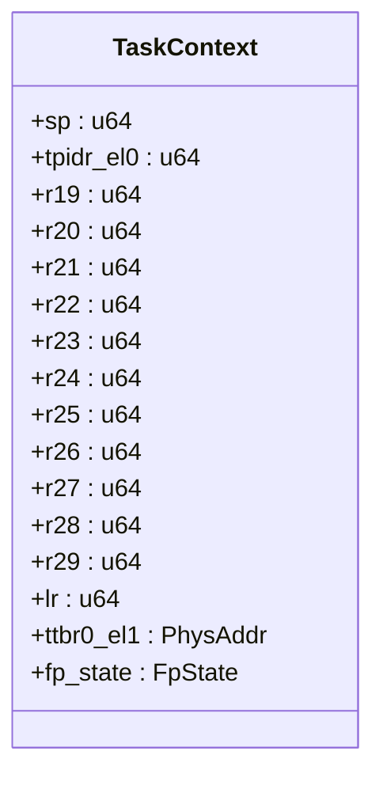
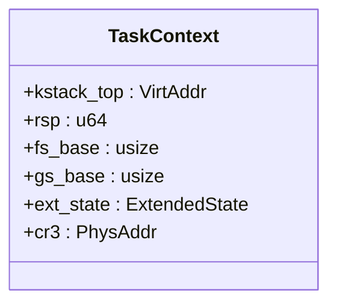
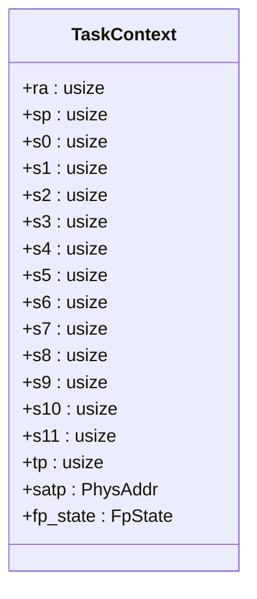
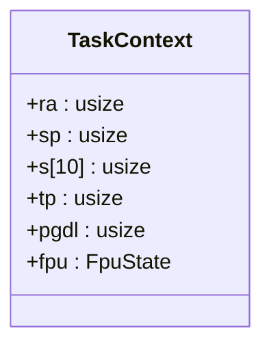
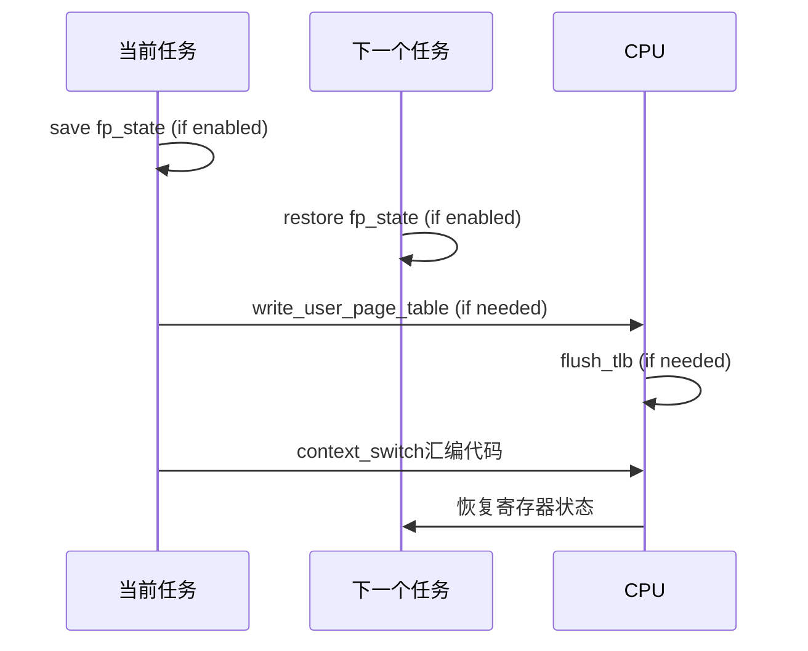

# 任务上下文管理

<cite>
**本文档中引用的文件**
- [context.rs](file://src/aarch64/context.rs)
- [context.rs](file://src/loongarch64/context.rs)
- [context.rs](file://src/riscv/context.rs)
- [context.rs](file://src/x86_64/context.rs)
- [asm.rs](file://src/aarch64/asm.rs)
- [asm.rs](file://src/loongarch64/asm.rs)
- [asm.rs](file://src/riscv/asm.rs)
- [asm.rs](file://src/x86_64/asm.rs)
</cite>

## 目录
1. [引言](#引言)
2. [TaskContext结构体设计](#taskcontext结构体设计)
3. [架构差异分析](#架构差异分析)
4. [上下文切换机制](#上下文切换机制)
5. [TLS与页表管理](#tls与页表管理)
6. [FP/SIMD状态处理](#fpsimd状态处理)
7. [实际使用示例](#实际使用示例)
8. [常见错误与调试技巧](#常见错误与调试技巧)

## 引言
本文档全面记录了`TaskContext`结构体的设计与实现，重点阐述其在进程调度和上下文切换中的核心作用。通过分析不同架构（aarch64、loongarch64、riscv、x86_64）下的具体实现，揭示通用寄存器保存、栈指针管理、线程本地存储（TLS）支持以及页表根寄存器切换等关键功能的底层机制。

## TaskContext结构体设计

`TaskContext`结构体用于保存任务的硬件状态，主要包括被调用者保存的寄存器、栈指针、线程指针以及浮点/SIMD状态。该结构体在上下文切换时起着至关重要的作用：当前任务将其CPU状态保存到内存中的`TaskContext`，而下一个任务则从其对应的`TaskContext`中恢复状态。

不同架构下`TaskContext`的具体字段有所不同，但都遵循相同的设计原则：
- 保存所有被调用者保存的寄存器（callee-saved registers）
- 保存栈指针（stack pointer）
- 支持线程本地存储（TLS）的线程指针
- 可选地包含浮点/SIMD状态
- 在用户空间特性启用时包含页表根寄存器

**Section sources**
- [context.rs](file://src/aarch64/context.rs#L96-L141)
- [context.rs](file://src/loongarch64/context.rs#L106-L154)
- [context.rs](file://src/riscv/context.rs#L136-L193)
- [context.rs](file://src/x86_64/context.rs#L151-L187)

## 架构差异分析

### aarch64架构
在aarch64架构下，`TaskContext`直接保存了多个通用寄存器（r19-r29）、链接寄存器（lr）和用户栈指针（sp）。特别地，使用`tpidr_el0`寄存器来管理线程本地存储，并通过`ttbr0_el1`寄存器管理用户空间页表根。



**Diagram sources**
- [context.rs](file://src/aarch64/context.rs#L96-L141)

### x86_64架构
x86_64架构的实现较为特殊，由于调用约定要求，被调用者保存的寄存器是通过`PUSH`指令压入内核栈的，而不是直接存储在`TaskContext`结构体中。因此，`TaskContext`中只保存了`RSP`（在所有寄存器压栈后的值）和内核栈顶指针`kstack_top`。



**Diagram sources**
- [context.rs](file://src/x86_64/context.rs#L151-L187)

### RISC-V架构
RISC-V架构的`TaskContext`保存了返回地址（ra）、栈指针（sp）以及s0-s11等被调用者保存的寄存器。线程指针由`tp`寄存器管理，页表根由`satp`寄存器管理。



**Diagram sources**
- [context.rs](file://src/riscv/context.rs#L136-L193)

### LoongArch64架构
LoongArch64架构需要保存从$r22到$r31的10个静态寄存器，这些寄存器被统一组织为一个数组`s`。此外还包括返回地址（ra）、栈指针（sp）和线程指针（tp）。



**Diagram sources**
- [context.rs](file://src/loongarch64/context.rs#L106-L154)

## 上下文切换机制

### switch_to方法剖析
`switch_to`方法是上下文切换的核心，它首先保存当前任务的上下文，然后恢复下一个任务的上下文。这个过程涉及多个步骤：

1. 保存当前任务的浮点/SIMD状态（如果启用）
2. 恢复下一个任务的浮点/SIMD状态（如果启用）
3. 如果页表根发生变化，则更新页表根寄存器并刷新TLB
4. 调用底层汇编代码进行实际的寄存器切换



**Diagram sources**
- [context.rs](file://src/aarch64/context.rs#L140-L175)
- [context.rs](file://src/loongarch64/context.rs#L153-L189)
- [context.rs](file://src/riscv/context.rs#L227-L264)
- [context.rs](file://src/x86_64/context.rs#L215-L254)

### 底层汇编实现
`switch_to`方法最终调用`context_switch`函数，这是一个用`naked_asm!`宏定义的裸函数，直接操作汇编代码以实现高效的上下文切换。

#### aarch64汇编实现
```assembly
// 保存旧上下文（被调用者保存的寄存器）
stp     x29, x30, [x0, 12 * 8]
stp     x27, x28, [x0, 10 * 8]
...
mov     x19, sp
mrs     x20, tpidr_el0
stp     x19, x20, [x0]

// 恢复新上下文
ldp     x19, x20, [x1]
mov     sp, x19
msr     tpidr_el0, x20
...
ret
```

#### x86_64汇编实现
```assembly
.code64
push    rbp
push   