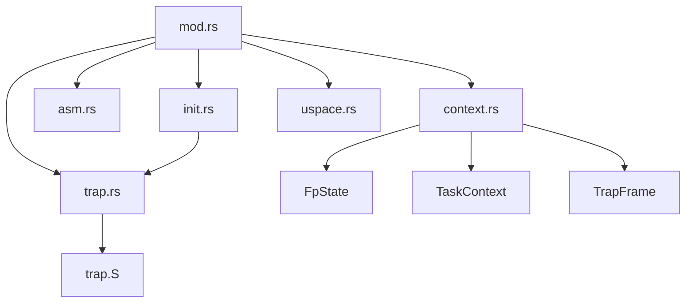
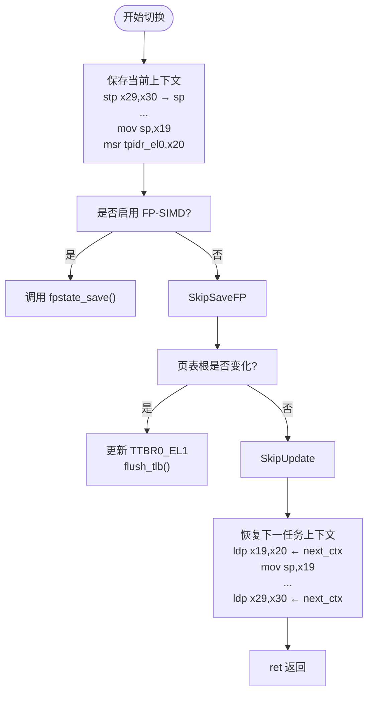
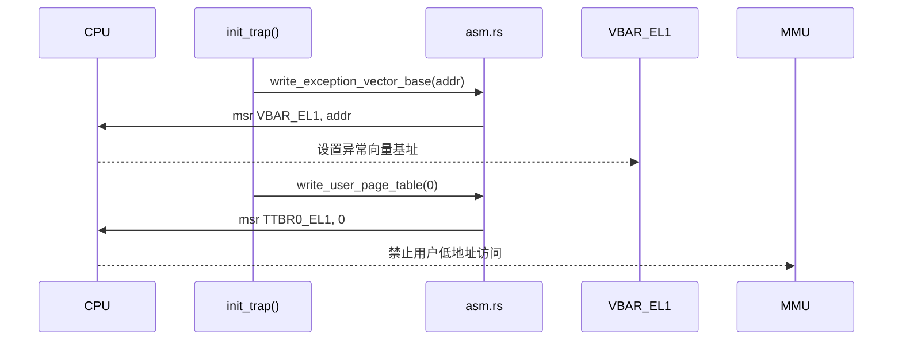
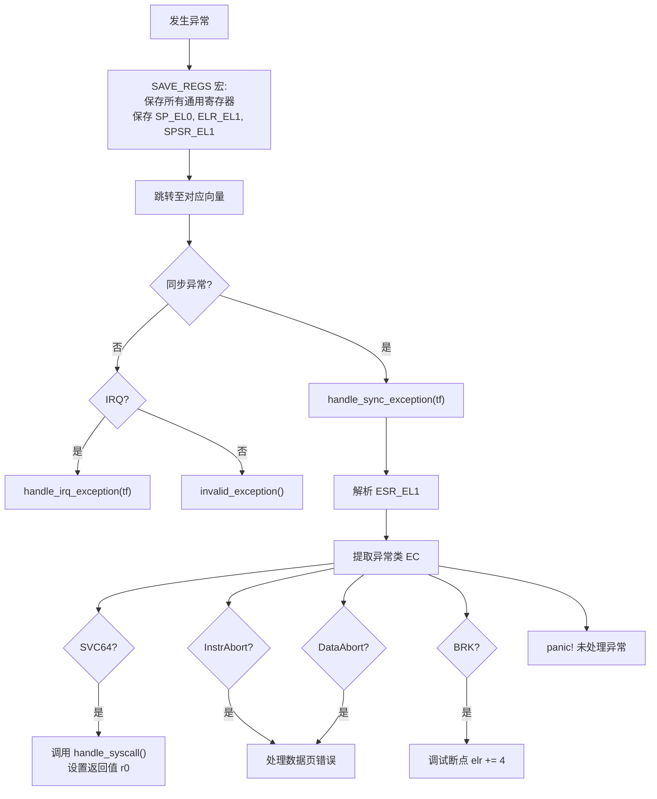
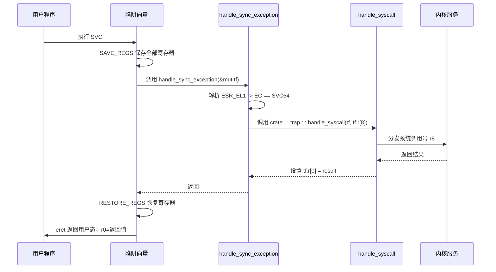

# AArch64 架构支持

<cite>
**本文档引用的文件**
- [mod.rs](file://src/aarch64/mod.rs)
- [context.rs](file://src/aarch64/context.rs)
- [asm.rs](file://src/aarch64/asm.rs)
- [init.rs](file://src/aarch64/init.rs)
- [trap.rs](file://src/aarch64/trap.rs)
- [uspace.rs](file://src/aarch64/uspace.rs)
- [trap.S](file://src/aarch64/trap.S)
</cite>

## 目录
1. [简介](#简介)
2. [模块组织结构](#模块组织结构)
3. [任务上下文与寄存器保存机制](#任务上下文与寄存器保存机制)
4. [零开销上下文切换实现](#零开销上下文切换实现)
5. [异常向量表初始化流程](#异常向量表初始化流程)
6. [异常分发逻辑分析](#异常分发逻辑分析)
7. [用户态支持与系统调用封装](#用户态支持与系统调用封装)
8. [陷阱处理完整链条](#陷阱处理完整链条)
9. [浮点状态保存与恢复机制](#浮点状态保存与恢复机制)
10. [结论](#结论)

## 简介
本项目 `axcpu` 提供了对多种 CPU 架构的支持，其中 AArch64 模块实现了完整的 ARMv8-A 架构底层功能。该模块涵盖上下文管理、异常处理、用户空间支持等核心操作系统机制，为运行在 EL1 特权级的操作系统内核提供必要的硬件抽象层。

**Section sources**
- [mod.rs](file://src/aarch64/mod.rs#L1-L12)

## 模块组织结构
AArch64 架构相关的代码被组织在 `src/aarch64` 目录下，通过 `mod.rs` 文件统一导出接口。主要模块包括：

- **context**: 定义任务上下文（TaskContext）和陷阱帧（TrapFrame），负责寄存器保存与恢复。
- **asm**: 封装底层汇编指令，如中断控制、页表操作、内存屏障等。
- **init**: 初始化 CPU 状态，包括异常向量设置、MMU 配置等。
- **trap**: 实现异常向量表和异常分发逻辑。
- **uspace**: 支持用户态执行环境，包含用户上下文构建与进入机制。

这些模块通过条件编译特性（如 `target_os = "none"` 和 `feature = "uspace"`）灵活启用或禁用特定功能。



**Diagram sources**
- [mod.rs](file://src/aarch64/mod.rs#L1-L12)

**Section sources**
- [mod.rs](file://src/aarch64/mod.rs#L1-L12)

## 任务上下文与寄存器保存机制
`TaskContext` 结构体定义在 `context.rs` 中，用于保存任务切换时需要保留的硬件状态。其设计遵循 AArch64 调用约定，仅保存**被调用者保存寄存器**（callee-saved registers），包括：

- 栈指针（sp）
- 帧指针（x29）和链接寄存器（x30）
- 寄存器 x19 到 x28
- 线程指针寄存器 `tpidr_el0`
- （可选）用户页表根寄存器 `ttbr0_el1`
- （可选）浮点/SIMD 状态 `fp_state`

该结构体采用 `#[repr(C)]` 布局以确保与汇编代码兼容，并通过 `switch_to` 方法实现上下文切换。

**Section sources**
- [context.rs](file://src/aarch64/context.rs#L150-L267)

## 零开销上下文切换实现
上下文切换的核心是 `context_switch` 函数，它是一个使用 `naked_asm!` 编写的裸函数（naked function），直接嵌入汇编代码以避免编译器插入额外的函数序言和尾声。

### 上下文保存与恢复流程


**Diagram sources**
- [context.rs](file://src/aarch64/context.rs#L210-L267)

**Section sources**
- [context.rs](file://src/aarch64/context.rs#L210-L267)
- [asm.rs](file://src/aarch64/asm.rs#L150-L170)

## 异常向量表初始化流程
异常向量表由汇编文件 `trap.S` 定义，起始地址由 `exception_vector_base` 符号标记。在系统初始化阶段，通过 `init_trap()` 函数将此地址写入 `VBAR_EL1` 寄存器，从而完成异常向量表注册。

### 初始化步骤
1. 获取 `exception_vector_base` 的运行时地址
2. 调用 `write_exception_vector_base()` 写入 `VBAR_EL1`
3. 设置 `TTBR0_EL1 = 0` 以禁止用户空间访问低地址区域

此外，`init_mmu()` 函数还负责配置 MMU 参数（TCR、MAIR、TTBR 等）并启用数据/指令缓存。



**Diagram sources**
- [init.rs](file://src/aarch64/init.rs#L80-L109)
- [asm.rs](file://src/aarch64/asm.rs#L180-L190)

**Section sources**
- [init.rs](file://src/aarch64/init.rs#L80-L109)

## 异常分发逻辑分析
当发生异常时，CPU 跳转至 `exception_vector_base` 处的向量表。根据异常类型和来源，执行相应的处理路径：

### 异常处理流程图


**Diagram sources**
- [trap.S](file://src/aarch64/trap.S#L1-L111)
- [trap.rs](file://src/aarch64/trap.rs#L50-L121)

**Section sources**
- [trap.rs](file://src/aarch64/trap.rs#L50-L121)
- [trap.S](file://src/aarch64/trap.S#L1-L111)

## 用户态支持与系统调用封装
`uspace.rs` 模块提供了从内核态进入用户态的能力。关键结构是 `UspaceContext`，它封装了一个 `TrapFrame`，表示用户态的初始执行环境。

### 用户态上下文初始化
```rust
let mut ctx = UspaceContext::new(entry, ustack_top, arg0);
ctx.enter_uspace(kstack_top);
```

`enter_uspace()` 使用内联汇编完成以下操作：
- 设置内核栈指针（sp）
- 恢复用户寄存器（x0-x30）
- 设置 `SP_EL0`（用户栈）、`ELR_EL1`（用户入口）、`SPSR_EL1`（处理器状态）
- 执行 `eret` 指令返回到用户态

系统调用通过 `SVC` 指令触发，由 `handle_sync_exception` 捕获并调用 `crate::trap::handle_syscall` 处理，返回值写入 `tf.r[0]`。

**Section sources**
- [uspace.rs](file://src/aarch64/uspace.rs#L1-L112)

## 陷阱处理完整链条
从用户态陷入内核的完整流程如下：



**Diagram sources**
- [trap.S](file://src/aarch64/trap.S#L1-L111)
- [trap.rs](file://src/aarch64/trap.rs#L50-L121)
- [uspace.rs](file://src/aarch64/uspace.rs#L80-L112)

**Section sources**
- [trap.rs](file://src/aarch64/trap.rs#L50-L121)
- [uspace.rs](file://src/aarch64/uspace.rs#L80-L112)

## 浮点状态保存与恢复机制
浮点与 SIMD 状态由 `FpState` 结构体管理，包含 32 个 128 位寄存器（V0-V31）以及 FPCR 和 FPSR 控制寄存器。

### 保存与恢复流程
```mermaid
flowchart TD
    SwitchTo[TaskContext::switch_to] --> EnableFP["确保 FP 已启用"]
    EnableFP --> SaveCurrent["调用 fpstate_save(self.fp_state)"]
    SaveCurrent --> RestoreNext["调用 fpstate_restore(next.fp_state)"]
    RestoreNext --> ContextSwitch["执行 context_switch"]

    subgraph fpstate_save
        direction TB
        A[fpstate_save(state)] --> B[mrs x9, fpcr]
        B --> C[mrs x10, fpsr]
        C --> D[stp q0-q31 到 state