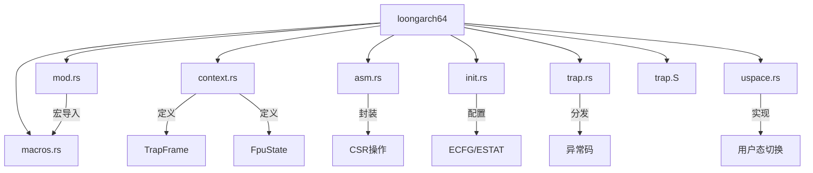
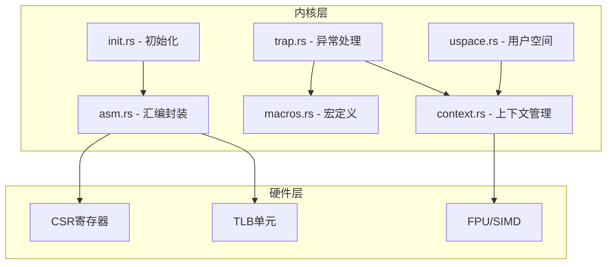
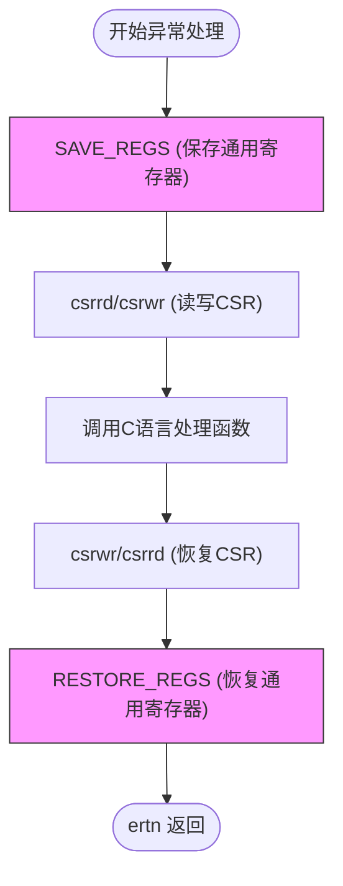
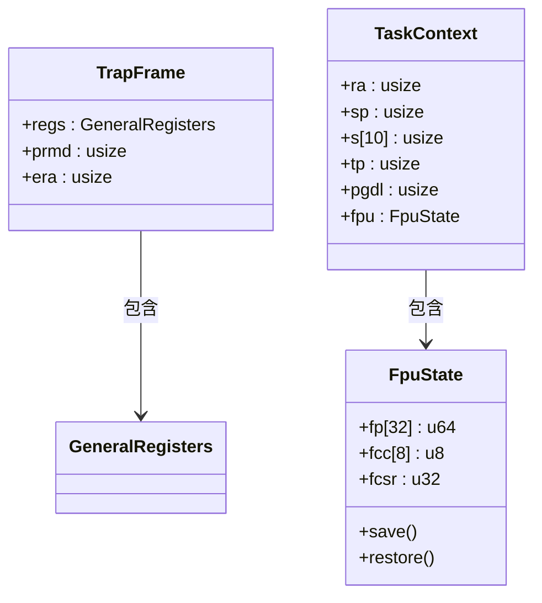

# LoongArch64 架构支持

<cite>
**本文档引用文件**  
- [mod.rs](file://src/loongarch64/mod.rs)
- [macros.rs](file://src/loongarch64/macros.rs)
- [context.rs](file://src/loongarch64/context.rs)
- [asm.rs](file://src/loongarch64/asm.rs)
- [init.rs](file://src/loongarch64/init.rs)
- [trap.rs](file://src/loongarch64/trap.rs)
- [uspace.rs](file://src/loongarch64/uspace.rs)
- [trap.S](file://src/loongarch64/trap.S)
- [trap.rs](file://src/trap.rs)
</cite>

## 目录
1. [简介](#简介)
2. [项目结构](#项目结构)
3. [核心组件](#核心组件)
4. [架构概览](#架构概览)
5. [详细组件分析](#详细组件分析)
6. [依赖分析](#依赖分析)
7. [性能考量](#性能考量)
8. [故障排查指南](#故障排查指南)
9. [结论](#结论)

## 简介
本文深入解析axcpu对国产LoongArch64指令集架构的支持实现。重点介绍CSR操作优化、中断响应延迟降低、FPU/SIMD寄存器映射、异常处理机制及用户态地址空间切换等关键技术细节，全面阐述系统调用路径与上下文恢复流程。

## 项目结构
LoongArch64架构支持模块位于`src/loongarch64`目录下，包含多个关键源文件，分别负责底层汇编、上下文管理、初始化配置、异常处理和用户空间支持等功能。

**图示来源**
- [mod.rs](file://src/loongarch64/mod.rs#L1-L13)
- [context.rs](file://src/loongarch64/context.rs#L0-L265)
- [asm.rs](file://src/loongarch64/asm.rs#L0-L187)
- [init.rs](file://src/loongarch64/init.rs#L0-L49)
- [trap.rs](file://src/loongarch64/trap.rs#L0-L73)
- [uspace.rs](file://src/loongarch64/uspace.rs#L0-L98)
- [trap.S](file://src/loongarch64/trap.S#L0-L80)

**本节来源**
- [mod.rs](file://src/loongarch64/mod.rs#L1-L13)
- [project_structure](file://#L1-L20)

## 核心组件
本模块的核心组件包括：用于优化CSR访问的宏系统、FPU状态管理结构体、异常入口配置函数、基于异常码的分发机制以及用户态上下文切换逻辑。

**本节来源**
- [mod.rs](file://src/loongarch64/mod.rs#L1-L13)
- [macros.rs](file://src/loongarch64/macros.rs#L0-L183)
- [context.rs](file://src/loongarch64/context.rs#L0-L265)

## 架构概览
axcpu为LoongArch64架构提供了完整的底层支持，涵盖从硬件寄存器操作到高级上下文切换的全栈实现。系统通过专用宏优化频繁的CSR读写操作，并利用内联汇编确保关键路径的高效执行。

**图示来源**
- [asm.rs](file://src/loongarch64/asm.rs#L0-L187)
- [macros.rs](file://src/loongarch64/macros.rs#L0-L183)
- [context.rs](file://src/loongarch64/context.rs#L0-L265)
- [trap.rs](file://src/loongarch64/trap.rs#L0-L73)
- [uspace.rs](file://src/loongarch64/uspace.rs#L0-L98)
- [init.rs](file://src/loongarch64/init.rs#L0-L49)

## 详细组件分析

### 宏系统优化CSR操作
`macros.rs`中定义的`include_asm_macros!`宏提供了一组CSR寄存器符号常量和通用寄存器压栈/出栈宏，显著提升了代码可读性和执行效率。特别是`PUSH_GENERAL_REGS`和`POP_GENERAL_REGS`宏通过批量操作减少了异常响应时延。

**图示来源**
- [macros.rs](file://src/loongarch64/macros.rs#L0-L183)
- [trap.S](file://src/loongarch64/trap.S#L0-L80)

**本节来源**
- [macros.rs](file://src/loongarch64/macros.rs#L0-L183)
- [trap.S](file://src/loongarch64/trap.S#L0-L80)

### FpuState结构体与SIMD/FPU寄存器映射
`context.rs`中的`FpuState`结构体精确映射了LoongArch64的FPU寄存器组，包含32个64位浮点寄存器、8个条件码寄存器和一个控制状态寄存器。该设计与x86_64的XMM/YMM和AARCH64的V寄存器在数量和布局上存在差异，体现了LoongArch独特的SIMD设计理念。

**图示来源**
- [context.rs](file://src/loongarch64/context.rs#L0-L265)

**本节来源**
- [context.rs](file://src/loongarch64/context.rs#L0-L265)

### eret指令行为与上下文恢复
在`trap.S`中，`ertn`指令用于异常返回。其行为特性要求在执行前必须正确设置`LA_CSR_ERA`（异常返回地址）和