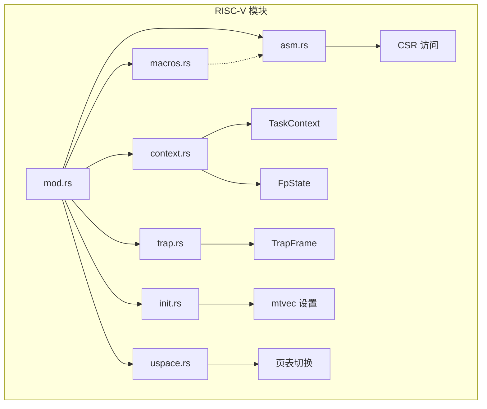
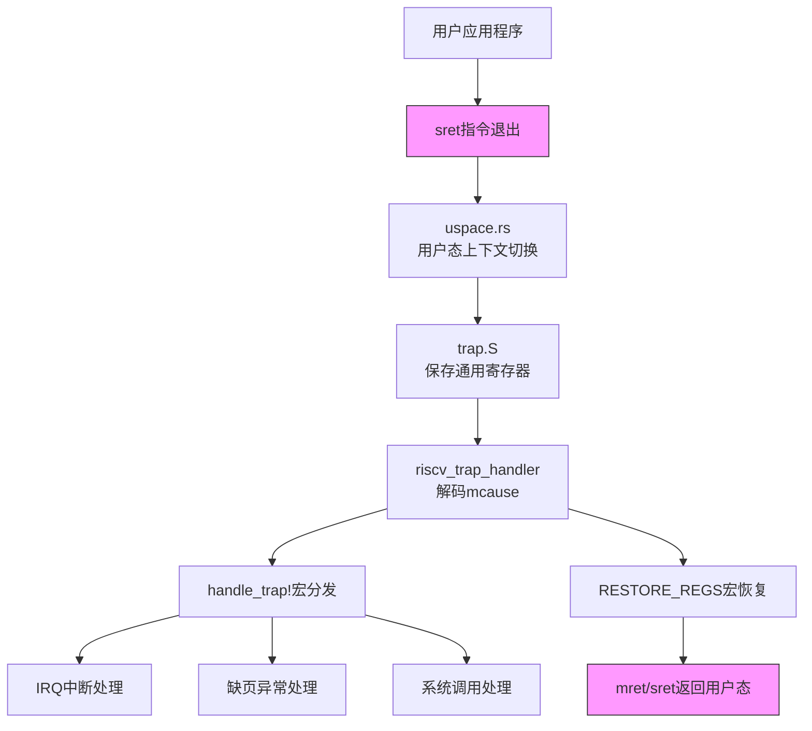
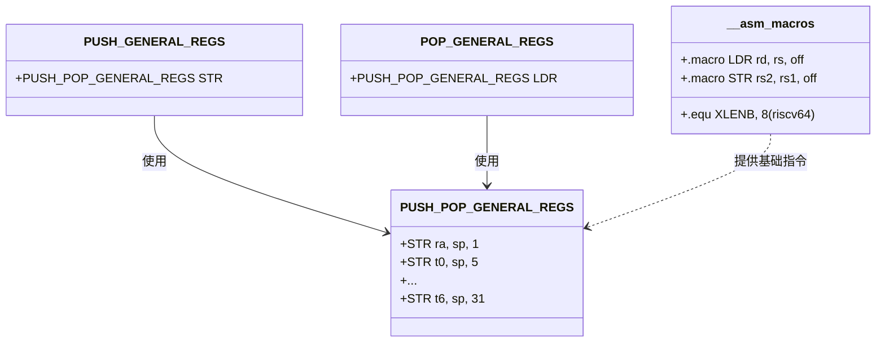
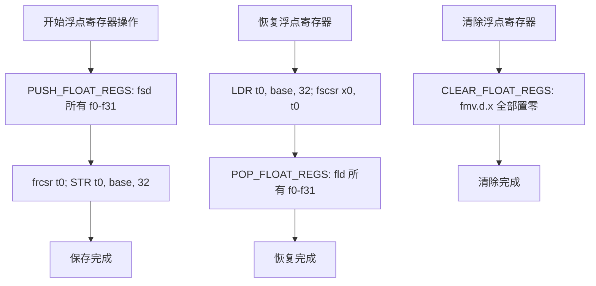

# RISC-V 架构支持

<cite>
**本文档引用的文件**
- [mod.rs](file://src/riscv/mod.rs)
- [macros.rs](file://src/riscv/macros.rs)
- [context.rs](file://src/riscv/context.rs)
- [asm.rs](file://src/riscv/asm.rs)
- [init.rs](file://src/riscv/init.rs)
- [trap.rs](file://src/riscv/trap.rs)
- [uspace.rs](file://src/riscv/uspace.rs)
- [trap.S](file://src/riscv/trap.S)
- [lib.rs](file://src/lib.rs)
</cite>

## 目录
1. [引言](#引言)
2. [项目结构概述](#项目结构概述)
3. [核心组件分析](#核心组件分析)
4. [架构概览](#架构概览)
5. [详细组件分析](#详细组件分析)
6. [依赖关系分析](#依赖关系分析)
7. [性能考量](#性能考量)
8. [故障排查指南](#故障排查指南)
9. [结论](#结论)

## 引言
本文系统阐述axcpu对RISC-V 64位架构的支持机制，重点剖析其在控制状态寄存器访问、异常处理流程、上下文保存与恢复、用户态隔离等方面的设计实现。通过深入分析关键模块的代码结构和交互逻辑，揭示该平台如何高效支持现代操作系统核心功能。

## 项目结构概述
axcpu为多架构CPU抽象层，其中RISC-V相关实现位于`src/riscv/`目录下，包含汇编接口、上下文管理、陷阱处理、初始化及用户空间支持等核心模块。各文件职责分明，协同完成底层硬件抽象。

**图示来源**
- [mod.rs](file://src/riscv/mod.rs#L1-L13)
- [context.rs](file://src/riscv/context.rs#L1-L335)
- [trap.rs](file://src/riscv/trap.rs#L1-L78)

**本节来源**
- [mod.rs](file://src/riscv/mod.rs#L1-L13)
- [project_structure](workspace_path)

## 核心组件

axcpu针对RISC-V架构实现了完整的上下文管理、陷阱处理、浮点单元调度和用户态支持机制。核心数据结构包括GeneralRegisters、FpState、TrapFrame和TaskContext，分别用于保存通用寄存器、浮点状态、中断帧和任务上下文。

**本节来源**
- [context.rs](file://src/riscv/context.rs#L1-L335)
- [trap.rs](file://src/riscv/trap.rs#L1-L78)

## 架构概览

axcpu的RISC-V支持架构分为四个主要层次：硬件抽象层（asm.rs）、上下文管理层（context.rs）、陷阱处理层（trap.rs）和用户空间接口层（uspace.rs）。这些组件通过清晰的接口协作，实现从硬件中断到高级系统调用的完整链路。

**图示来源**
- [trap.S](file://src/riscv/trap.S#L1-L69)
- [trap.rs](file://src/riscv/trap.rs#L1-L78)
- [uspace.rs](file://src/riscv/uspace.rs#L1-L112)

## 详细组件分析

### 宏定义机制分析
`macros.rs`文件中的宏定义为RISC-V平台提供了统一的汇编级抽象，简化了跨XLEN（32/64位）的内存操作和寄存器保存/恢复逻辑。

#### 寄存器操作宏设计

**图示来源**
- [macros.rs](file://src/riscv/macros.rs#L50-L180)
- [trap.S](file://src/riscv/trap.S#L1-L69)

#### 浮点寄存器宏扩展
当启用`fp-simd`特性时，`include_fp_asm_macros!`宏提供了一套完整的浮点寄存器保存、恢复和清零操作，确保FPU状态正确迁移。

**图示来源**
- [macros.rs](file://src/riscv/macros.rs#L20-L4