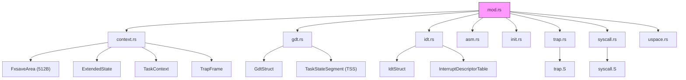
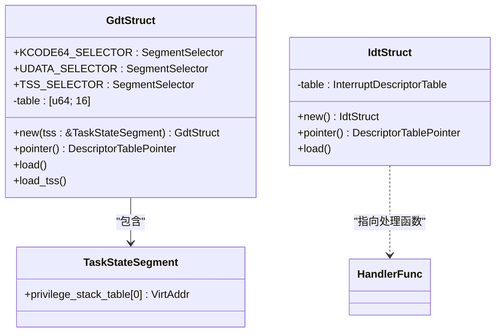
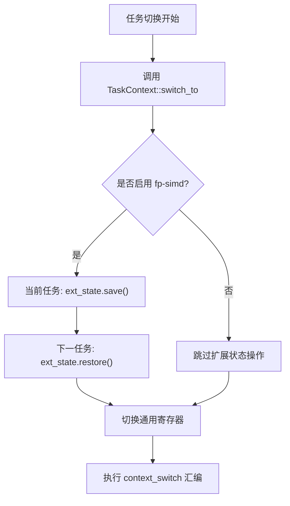
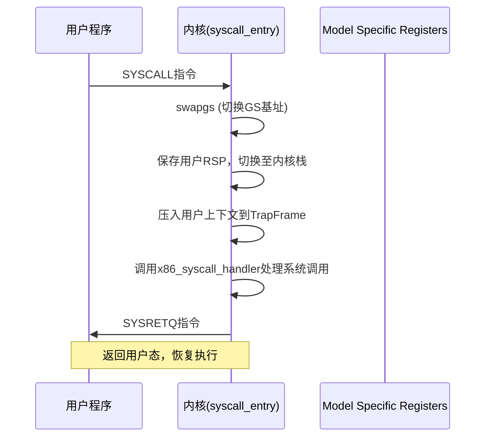

# x86_64 架构支持

<cite>
**本文档引用的文件**
- [mod.rs](file://src/x86_64/mod.rs)
- [context.rs](file://src/x86_64/context.rs)
- [asm.rs](file://src/x86_64/asm.rs)
- [init.rs](file://src/x86_64/init.rs)
- [gdt.rs](file://src/x86_64/gdt.rs)
- [idt.rs](file://src/x86_64/idt.rs)
- [trap.rs](file://src/x86_64/trap.rs)
- [syscall.rs](file://src/x86_64/syscall.rs)
- [uspace.rs](file://src/x86_64/uspace.rs)
- [trap.S](file://src/x86_64/trap.S)
- [syscall.S](file://src/x86_64/syscall.S)
</cite>

## 目录
1. [引言](#引言)
2. [模块结构与核心抽象](#模块结构与核心抽象)
3. [GDT 与 IDT 的结构封装及初始化](#gdt-与-idt-的结构封装及初始化)
4. [扩展寄存器状态管理：ExtendedState 与 FxsaveArea](#扩展寄存器状态管理extendedstate-与-fxsavearea)
5. [任务切换与模式转换机制](#任务切换与模式转换机制)
6. [段式内存初始化流程](#段式内存初始化流程)
7. [异常向量注册与 Trap 处理](#异常向量注册与-trap-处理)
8. [系统调用接口封装](#系统调用接口封装)
9. [用户空间上下文与特权级切换](#用户空间上下文与特权级切换)
10. [Page Fault 处理全流程解析](#page-fault-处理全流程解析)

## 引言
本文档全面解析 `axcpu` 对 x86_64 架构的抽象实现，涵盖从硬件描述符表到系统调用、异常处理和用户态切换的完整机制。重点分析全局描述符表（GDT）、中断描述符表（IDT）的结构设计，深入探讨浮点/SIMD 扩展寄存器的状态保存与恢复，并结合汇编代码说明任务切换与模式转换的具体实现路径。

## 模块结构与核心抽象

`axcpu` 在 `x86_64` 目录下通过多个模块协同完成对底层架构的封装。`mod.rs` 作为入口模块，组织了 `context`、`gdt`、`idt` 等关键子模块，并对外暴露 `TaskContext`、`TrapFrame`、`GdtStruct` 和 `IdtStruct` 等核心类型，形成统一的 CPU 抽象接口。

**图示来源**
- [mod.rs](file://src/x86_64/mod.rs#L1-L20)

**本节来源**
- [mod.rs](file://src/x86_64/mod.rs#L1-L20)

## GDT 与 IDT 的结构封装及初始化

### GDT 结构与初始化
`gdt.rs` 定义了 `GdtStruct` 类型，封装了一个最多包含 16 个条目的全局描述符表。该结构预定义了内核与用户态的代码/数据段选择子（如 `KCODE64_SELECTOR`、`UDATA_SELECTOR`），并支持将任务状态段（TSS）嵌入其中。TSS 用于在特权级切换时自动加载内核栈指针（RSP0）。

`init_gdt()` 函数负责初始化每个 CPU 上的 GDT 和 TSS，并通过 `lgdt` 指令加载到 CPU 中，随后更新 CS 寄存器以启用 64 位代码段。

### IDT 结构与初始化
`idt.rs` 提供了 `IdtStruct` 封装，其内部为 `x86_64::structures::idt::InterruptDescriptorTable`。该模块在初始化时会链接一个名为 `trap_handler_table` 的外部符号数组，该数组由汇编文件 `trap.S` 生成，包含了 256 个中断向量的处理函数地址。

`init_idt()` 函数创建 `IdtStruct` 实例，遍历所有中断向量并设置对应的处理函数，特别地，允许用户态触发断点（`int 3`）和传统的 `int 0x80` 系统调用。最后通过 `lidt` 指令将 IDT 加载至 CPU。

**图示来源**
- [gdt.rs](file://src/x86_64/gdt.rs#L1-L130)
- [idt.rs](file://src/x86_64/idt.rs#L1-L82)

**本节来源**
- [gdt.rs](file://src/x86_64/gdt.rs#L1-L130)
- [idt.rs](file://src/x86_64/idt.rs#L1-L82)

## 扩展寄存器状态管理：ExtendedState 与 FxsaveArea

`context.rs` 中的 `FxsaveArea` 是一个 512 字节、16 字节对齐的结构体，用于存储 x87 FPU、MMX、XMM（SSE）和 MXCSR 寄存器的状态。它直接映射到 `FXSAVE/FXRSTOR` 指令所需的数据格式。

`ExtendedState` 结构体包装了 `FxsaveArea`，并通过 `fp-simd` 特性门控提供 `save()` 和 `restore()` 方法。`save()` 使用 `_fxsave64` 内建函数将当前 CPU 的扩展寄存器状态保存到 `fxsave_area`；`restore()` 则使用 `_fxrstor64` 将状态恢复。这确保了在任务切换时，浮点和 SIMD 计算的上下文得以正确保留。

**图示来源**
- [context.rs](file://src/x86_64/context.rs#L1-L291)

**本节来源**
- [context.rs](file://src/x86_64/context.rs#L1-L291)

## 任务切换与模式转换机制

任务切换的核心是 `context.rs` 中的 `context_switch` 函数，这是一个用 `naked_asm!` 编写的裸函数。它手动保存和恢复 RBP、RBX、R12-R15 等被调用者保存的寄存器，并通过修改 `RSP` 来切换堆栈。

当涉及用户态时，模式转换通过两种方式实现：
1. **IRETQ 指令**：在 `uspace.rs` 的 `enter_uspace` 函数中，通过 `iretq` 指令从内核栈返回到用户态。此指令会弹出用户态的 `RIP`、`CS`、`RFLAGS`、`RSP` 和 `SS`，实现从 Ring 0 到 Ring 3 的跳转。
2. **SYSCALL/SYSRET 指令**：在 `syscall.rs` 中，通过配置 `MSR_LSTAR`（系统调用目标地址）、`MSR_STAR`（段选择子）和 `MSR_SF_MASK`（标志掩码）来启用快速系统调用。进入时 `syscall` 指令跳转至 `syscall_entry`，退出时 `sysretq` 返回用户态。

**图示来源**
- [asm.rs](file://src/x86_64/asm.rs#L1-L142)
- [syscall.rs](file://src/x86_64/syscall.rs#L1-L49)
- [syscall.S](file://src/x86_64/syscall.S#L1-L56)

**本节来源**
- [asm.rs](file://src/x86_64/asm.rs#L1-L142)
- [syscall.rs](file://src/x86_64/syscall.rs#L1-L49)
- [syscall.S](file://src/x86_64/syscall.S#L1-L56)

## 段式内存初始化流程

`init.rs` 提供了 `init_trap()` 函数，这是 x86_64 平台陷阱处理初始化的总入口。该函数必须在调用 `percpu` 初始化后执行。

`init_trap()` 依次调用：
1. `init_gdt()`：初始化并加载 GDT 和 TSS。
2. `init_idt()`：初始化并加载 IDT。
3. （若启用 `uspace`）`init_syscall()`：配置 MSRs 以支持 `syscall`/`sysret` 快速系统调用。

这一系列操作为 CPU 设置了完整的保护模式运行环境，包括内存分段、中断响应和系统调用机制。

**本节来源**
- [init.rs](file://src/x86_64/init.rs#L1-L39)

## 异常向量注册与 Trap 处理

`trap.S` 汇编文件使用宏为 256 个中断向量生成独立的处理程序。这些处理程序首先压入中断向量号和错误码（如果需要），然后跳转到公共的 `.Ltrap_common` 例程。

`.Ltrap_common` 例程检查来源是否为用户态（通过 `RSP+3*8` 即 `CS` 寄存器的低两位），如果是，则执行 `swapgs` 切换到内核 GS 基址。接着，它保存所有通用寄存器到栈上，形成一个 `TrapFrame` 结构，并调用 Rust 编写的 `x86_trap_handler` 函数。

`trap.rs` 中的 `x86_trap_handler` 根据 `tf.vector` 分发异常。例如，`PAGE_FAULT_VECTOR` 触发 `handle_page_fault`，该函数解析 `CR2` 寄存器中的错误