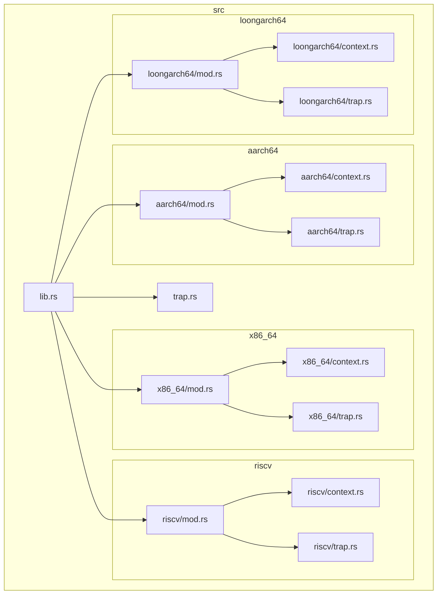
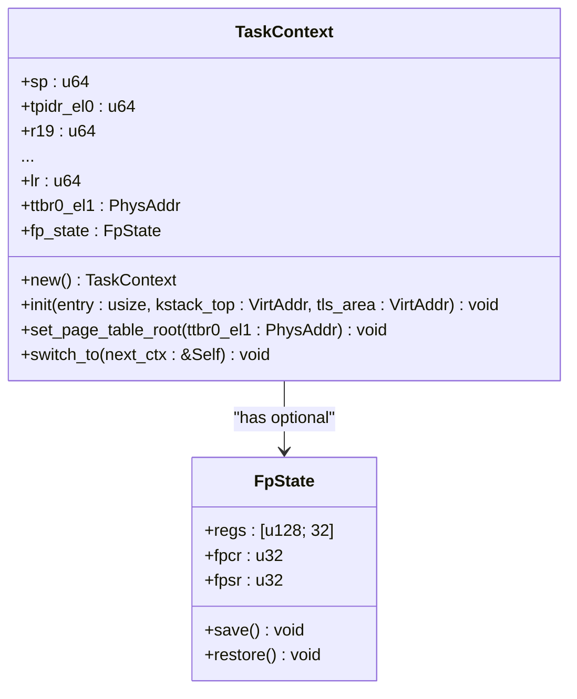

# 多架构抽象层

<cite>
**本文档引用的文件**
- [lib.rs](file://src/lib.rs)
- [aarch64/mod.rs](file://src/aarch64/mod.rs)
- [x86_64/mod.rs](file://src/x86_64/mod.rs)
- [riscv/mod.rs](file://src/riscv/mod.rs)
- [loongarch64/mod.rs](file://src/loongarch64/mod.rs)
- [aarch64/context.rs](file://src/aarch64/context.rs)
- [x86_64/context.rs](file://src/x86_64/context.rs)
- [riscv/context.rs](file://src/riscv/context.rs)
- [loongarch64/context.rs](file://src/loongarch64/context.rs)
- [aarch64/trap.rs](file://src/aarch64/trap.rs)
- [x86_64/trap.rs](file://src/x86_64/trap.rs)
- [riscv/trap.rs](file://src/riscv/trap.rs)
- [loongarch64/trap.rs](file://src/loongarch64/trap.rs)
- [trap.rs](file://src/trap.rs)
</cite>

## 目录
1. [引言](#引言)
2. [项目结构](#项目结构)
3. [核心组件](#核心组件)
4. [架构概览](#架构概览)
5. [详细组件分析](#详细组件分析)
6. [依赖分析](#依赖分析)
7. [性能考量](#性能考量)
8. [故障排除指南](#故障排除指南)
9. [结论](#结论)

## 引言
`axcpu` 是一个为操作系统内核设计的多架构CPU抽象库，旨在通过统一的API接口支持多种处理器架构。该库的核心目标是实现跨平台兼容性，同时确保零运行时开销。通过利用Rust语言的条件编译机制和`cfg-if`宏，`axcpu`能够在编译期根据目标架构选择对应的模块实现，从而提供高效的硬件抽象。

本技术文档将深入分析`axcpu`的多架构抽象设计，重点探讨其如何在`src/lib.rs`中使用`cfg-if`宏进行编译期架构选择，以及四种主要架构（aarch64、x86_64、riscv、loongarch64）在各自`mod.rs`文件中的接口一致性设计。我们将展示适配器模式的实际应用，并详细说明条件编译策略如何确保零成本抽象。此外，文档还将通过具体代码示例演示不同架构下的上下文切换和陷阱处理调用方式，并讨论这种架构决策对跨平台内核开发的可维护性和扩展性带来的优势。

## 项目结构
`axcpu`项目的目录结构清晰地体现了其多架构设计理念。根目录下的`src`文件夹包含了所有源代码，其中每个子目录对应一种特定的CPU架构：`aarch64`、`x86_64`、`riscv`和`loongarch64`。每种架构都拥有独立的实现文件，包括`context.rs`（上下文管理）、`trap.rs`（陷阱处理）、`init.rs`（初始化）等，确保了架构特定代码的隔离性。

顶层的`lib.rs`文件作为整个库的入口点，负责根据编译目标选择并导出相应的架构模块。此外，还有一个位于`src`根目录的`trap.rs`文件，它定义了跨架构共享的陷阱处理接口和宏，实现了公共逻辑的集中化。这种分层结构既保证了各架构实现的独立性，又通过统一的公共接口维持了API的一致性。



**Diagram sources**
- [lib.rs](file://src/lib.rs)
- [aarch64/mod.rs](file://src/aarch64/mod.rs)
- [x86_64/mod.rs](file://src/x86_64/mod.rs)
- [riscv/mod.rs](file://src/riscv/mod.rs)
- [loongarch64/mod.rs](file://src/loongarch64/mod.rs)

**Section sources**
- [lib.rs](file://src/lib.rs)
- [aarch64/mod.rs](file://src/aarch64/mod.rs)
- [x86_64/mod.rs](file://src/x86_64/mod.rs)
- [riscv/mod.rs](file://src/riscv/mod.rs)
- [loongarch64/mod.rs](file://src/loongarch64/mod.rs)

## 核心组件
`axcpu`的核心组件围绕两个关键数据结构展开：`TaskContext`和`TrapFrame`。这两个结构分别用于任务上下文切换和异常/中断处理，是实现多架构抽象的基础。

`TaskContext`结构体封装了任务执行所需的全部硬件状态，包括栈指针、返回地址、被调用者保存寄存器以及可选的浮点/SIMD状态和页表根地址。尽管不同架构的具体寄存器布局和名称各异，但`TaskContext`为所有架构提供了统一的接口，如`init()`用于初始化新任务，`switch_to()`用于执行上下文切换。

`TrapFrame`结构体则在发生陷阱（如系统调用、页面错误、中断）时捕获CPU的当前状态。它保存了触发陷阱时的通用寄存器、程序计数器和状态寄存器等信息。同样，虽然各架构的寄存器集合不同，但`TrapFrame`通过一致的方法（如`arg0()`, `arg1()`）暴露系统调用参数，屏蔽了底层差异。

这些核心组件的设计体现了适配器模式的应用：每个架构模块内部实现具体的硬件操作，而对外暴露的API保持高度一致，使得上层内核代码可以不关心底层架构细节。

**Section sources**
- [aarch64/context.rs](file://src/aarch64/context.rs)
- [x86_64/context.rs](file://src/x86_64/context.rs)
- [riscv/context.rs](file://src/riscv/context.rs)
- [loongarch64/context.rs](file://src/loongarch64/context.rs)
- [aarch64/trap.rs](file://src/aarch64/trap.rs)
- [x86_64/trap.rs](file://src/x86_64/trap.rs)
- [riscv/trap.rs](file://src/riscv/trap.rs)
- [loongarch64/trap.rs](file://src/loongarch64/trap.rs)

## 架构概览
`axcpu`的整体架构基于编译期多态性，通过Rust的条件编译特性实现。其核心思想是在编译时确定目标架构，并链接相应的实现模块，从而避免任何运行时分支判断，达到零成本抽象的目标。

架构的核心是`src/lib.rs`文件中的`cfg-if`宏块。该宏根据`target_arch`配置项的值，在编译期选择导入`x86_64`、`riscv`、`aarch64`或`loongarch64`模块之一，并将其内容重新导出。这意味着最终生成的二进制文件只包含目标架构所需的确切代码，没有多余的抽象层或间接调用。

上层内核代码通过统一的`axcpu` API与CPU交互。当调用`TaskContext::switch_to()`或处理陷阱时，编译器会直接链接到所选架构的特定实现。例如，`switch_to()`方法内部会调用用汇编编写的`context_switch`函数，该函数针对特定架构的寄存器和指令集进行了优化。

这种设计不仅保证了高性能，还极大地提升了代码的可维护性。添加新架构只需创建一个新的子目录并实现必要的模块，而无需修改现有代码或引入复杂的运行时调度逻辑。

```mermaid
graph TD
A["编译期: cargo build --target <ARCH>"] --> B{"cfg-if 宏"}
B --> |target_arch = \"x86_64\"| C[x86_64 模块]
B --> |target_arch = \"aarch64\"| D[aarch64 模块]
B --> |target_arch = \"riscv64\"| E[riscv 模块]
B --> |target_arch = \"loongarch64\"| F[loongarch64 模块]
C --> G["x86_64/context.rs"]
C --> H["x86_64/trap.rs"]
D --> I["aarch64/context.rs"]
D --> J["aarch64/trap.rs"]
E --> K["riscv/context.rs"]
E --> L["riscv/trap.rs"]
F --> M["loongarch64/context.rs"]
F --> N["loongarch64/trap.rs"]
O["上层内核代码"] --> P["axcpu API"]
P --> B
```

**Diagram sources**
- [lib.rs](file://src/lib.rs)

**Section sources**
- [lib.rs](file://src/lib.rs)

## 详细组件分析

### 上下文管理分析
`TaskContext`是`axcpu`中实现任务调度的关键组件。它为不同架构提供了统一的上下文管理接口，其核心功能是`switch_to()`方法，用于在任务间进行上下文切换。

尽管各架构的`TaskContext`实现细节不同，但它们遵循相同的设计原则。以`aarch64`为例，其`TaskContext`包含`sp`（栈指针）、`lr`（链接寄存器）和一系列被调用者保存的通用寄存器（`r19`到`r29`）。`x86_64`版本则利用了x86-64的调用约定，将被调用者保存的寄存器压入内核栈，并通过`rsp`字段记录栈顶位置。`riscv`和`loongarch64`也类似，分别保存了各自的被调用者保存寄存器。

`switch_to()`方法的实现展示了适配器模式的强大之处。该方法首先检查是否启用了`fp-simd`特性，如果是，则调用架构特定的`save()`和`restore()`方法来处理浮点/SIMD状态。接着，如果启用了`uspace`特性，它会比较当前和下一个任务的页表根地址（如`ttbr0_el1`、`cr3`、`satp`、`pgdl`），并在不同时更新硬件寄存器并刷新TLB。最后，它调用用内联汇编编写的`context_switch`函数，该函数直接操作CPU寄存器完成实际的上下文切换。

这种设计确保了无论底层架构如何，上层代码都可以用完全相同的方式调用`switch_to()`，极大地简化了内核调度器的实现。

#### 上下文切换类图


**Diagram sources**
- [aarch64/context.rs](file://src/aarch64/context.rs)

#### 上下文切换序列图
```mermaid
sequenceDiagram
    participant Current as 当前任务
    participant Next as 下一任务
    participant CPU as CPU
    
    Current->>Current: switch_to(&next_ctx)
    opt fp-simd 特性启用
        Current->>FpState: save()
        Next->>FpState: restore()
    end
    opt uspace 特性启用且页表不同
        CPU->>CPU: write_user_page_table(next_ttbr)
        CPU->>CPU: flush_tlb()
    end
    CPU->>CPU: context_switch(current_ctx, next_ctx)
    CPU-->>Next: 执行下一任务
``