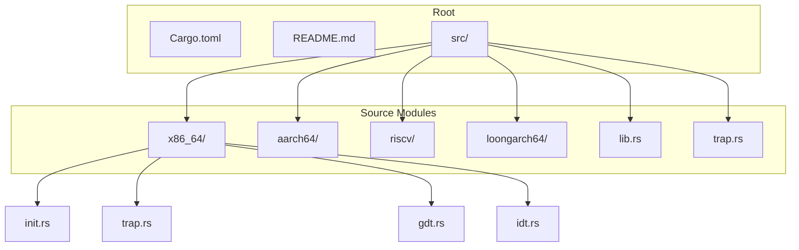
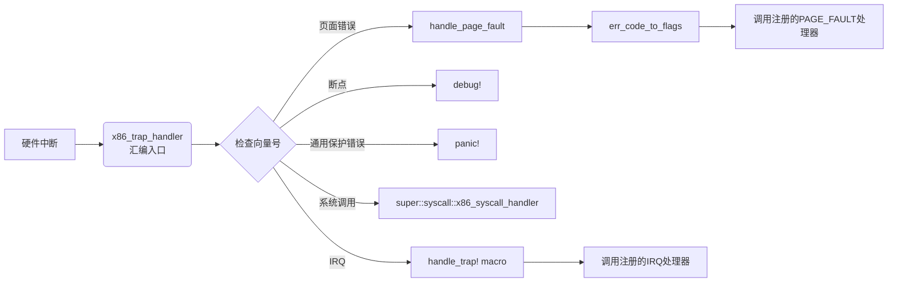
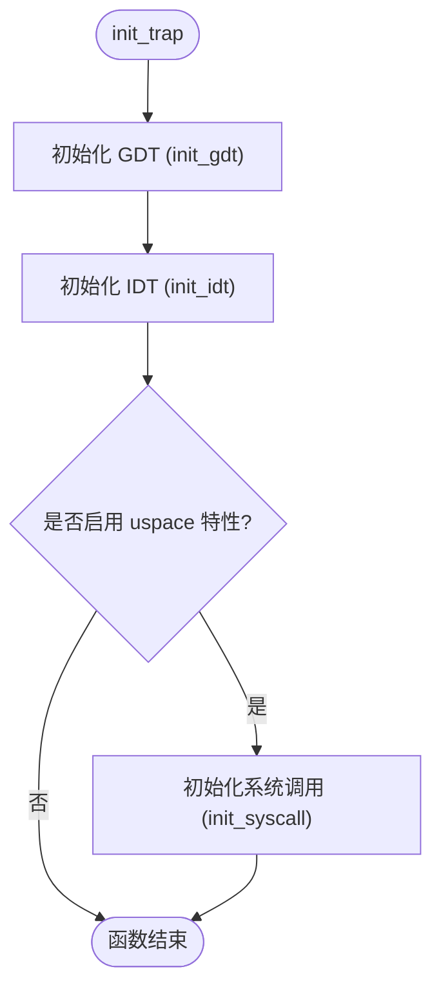
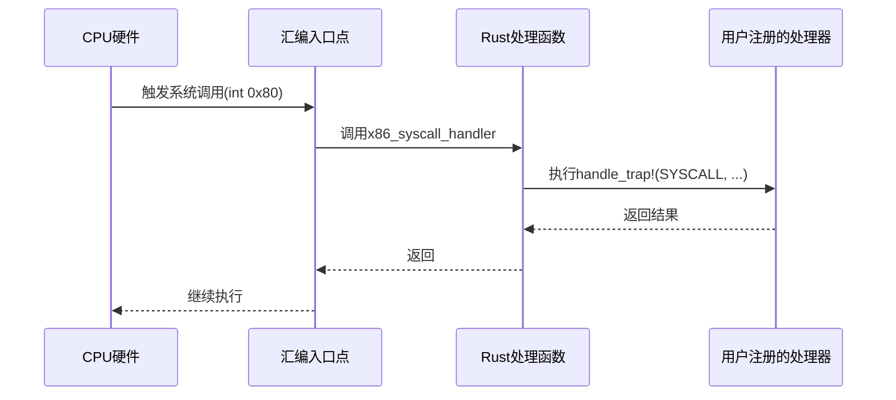
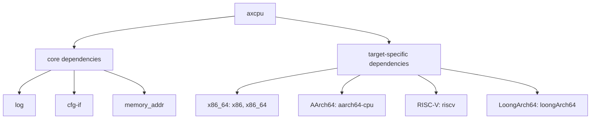

<cite>
**本文档中引用的文件**
- [Cargo.toml](file://Cargo.toml)
- [README.md](file://README.md)
- [src/lib.rs](file://src/lib.rs)
- [src/x86_64/init.rs](file://src/x86_64/init.rs)
- [src/x86_64/trap.rs](file://src/x86_64/trap.rs)
- [src/trap.rs](file://src/trap.rs)
</cite>

# 快速开始

## 目录
1. [简介](#简介)
2. [项目结构](#项目结构)
3. [核心组件](#核心组件)
4. [架构概述](#架构概述)
5. [详细组件分析](#详细组件分析)
6. [依赖分析](#依赖分析)
7. [性能考虑](#性能考虑)
8. [故障排除指南](#故障排除指南)
9. [结论](#结论)

## 简介

`axcpu` 是一个为多种 CPU 架构提供特权指令和结构抽象的 Rust 库，专为操作系统内核的硬件抽象层（HAL）设计。本指南旨在帮助新手开发者快速将 `axcpu` 集成到自己的操作系统内核项目中，通过详细的步骤说明、代码示例和预期输出，指导开发者在 5 分钟内完成环境搭建并成功触发第一个 trap 处理流程。

**Section sources**
- [README.md](file://README.md#L1-L15)

## 项目结构

`axcpu` 仓库采用清晰的模块化设计，按目标架构组织源代码。根目录包含 `Cargo.toml` 和 `README.md` 文件，而 `src` 目录下则有针对不同架构（x86_64, aarch64, riscv, loongarch64）的子模块以及一个顶层的 `lib.rs` 文件。这种结构使得库能够根据编译目标自动选择正确的实现。

**Diagram sources**
- [src/lib.rs](file://src/lib.rs#L1-L29)
- [src/x86_64/init.rs](file://src/x86_64/init.rs#L1-L39)

## 核心组件

`axcpu` 的核心功能围绕着陷阱（trap）处理机制展开。主要组件包括：
- **初始化函数**：如 `init_trap`，负责设置中断描述符表（IDT）、全局描述符表（GDT）等关键数据结构。
- **陷阱处理框架**：定义了统一的陷阱帧（TrapFrame）和处理宏，用于捕获和响应各种异常与中断。
- **特性门控（Feature Gates）**：通过 `uspace`、`fp-simd` 等特性，允许用户按需启用特定功能，如用户空间系统调用支持或浮点 SIMD 指令。

**Section sources**
- [src/x86_64/init.rs](file://src/x86_64/init.rs#L1-L39)
- [src/trap.rs](file://src/trap.rs#L1-L45)

## 架构概述

`axcpu` 的架构设计遵循条件编译原则，利用 `cfg_if!` 宏在编译时根据目标架构选择相应的模块。顶层 `lib.rs` 负责路由，而具体架构的实现（如 x86_64）则封装了所有与该平台相关的细节。陷阱处理的核心是汇编语言编写的入口点 `x86_trap_handler`，它在接收到硬件中断后，会跳转到 Rust 编写的 `handle_page_fault` 等具体处理函数。

**Diagram sources**
- [src/x86_64/trap.rs](file://src/x86_64/trap.rs#L1-L93)
- [src/trap.rs](file://src/trap.rs#L1-L45)

## 详细组件分析

### 初始化陷阱处理机制

`init_trap` 函数是启动陷阱处理的关键。它首先调用 `init_gdt` 和 `init_idt` 来初始化全局和中断描述符表，这是 x86_64 架构上进行内存管理和中断处理的基础。如果启用了 `uspace` 特性，它还会调用 `init_syscall` 来配置系统调用相关的模型特定寄存器（MSR），从而支持 `syscall` 指令。

#### 初始化流程图

**Diagram sources**
- [src/x86_64/init.rs](file://src/x86_64/init.rs#L25-L38)

### 注册系统调用处理器

`axcpu` 使用 `linkme` crate 提供的 `distributed_slice` 宏来管理陷阱处理器。通过 `#[register_trap_handler]` 属性，用户可以将自定义的处理函数注册到 `SYSCALL`、`PAGE_FAULT` 或 `IRQ` 切片中。当发生相应事件时，`handle_trap!` 宏会遍历这些切片并调用已注册的处理器。

#### 系统调用处理序列图

**Diagram sources**
- [src/x86_64/trap.rs](file://src/x86_64/trap.rs#L1-L93)
- [src/trap.rs](file://src/trap.rs#L1-L45)

## 依赖分析

`axcpu` 的依赖关系清晰地分为核心依赖和架构特定依赖。核心依赖如 `log`、`cfg-if` 和 `memory_addr` 在所有平台上都使用。而架构特定依赖则通过 `target.'cfg(...)'` 语法精确控制，例如 x86_64 平台依赖 `x86` 和 `x86_64` crate，AArch64 平台依赖 `aarch64-cpu`。这种设计确保了代码的可移植性和最小化依赖。

**Diagram sources**
- [Cargo.toml](file://Cargo.toml#L1-L62)

## 性能考虑

由于 `axcpu` 主要由底层系统调用和中断处理组成，其性能至关重要。库的设计避免了动态分配和运行时开销，所有关键路径上的操作都是静态确定的。`handle_trap!` 宏虽然目前只支持单个处理器（遇到多个会发出警告），但这保证了极低的调用延迟。未来可以通过优化宏逻辑来支持多处理器而无需牺牲太多性能。

## 故障排除指南

在集成过程中，常见的问题包括未正确调用 `init_percpu` 导致 per-CPU 数据结构未初始化，或忘记在 `Cargo.toml` 中启用 `uspace` 特性而导致