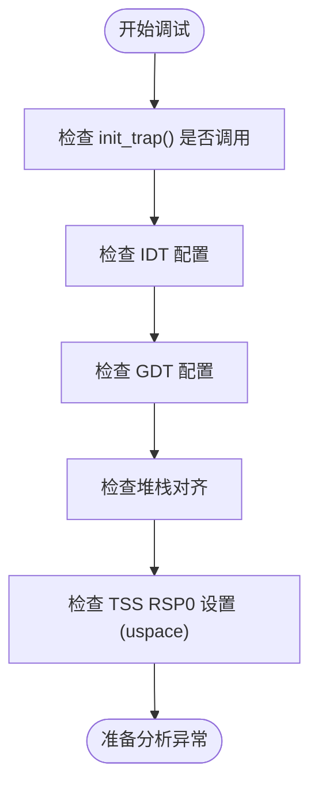
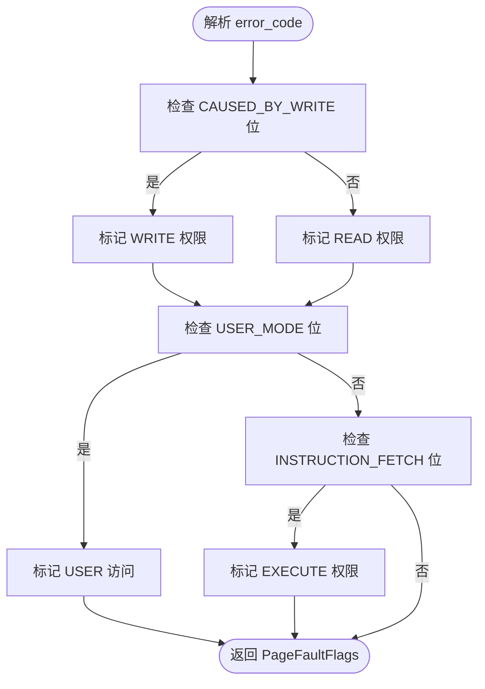

# 故障排查指南

<cite>
**本文档引用的文件**
- [src/aarch64/trap.rs](file://src/aarch64/trap.rs)
- [src/loongarch64/trap.rs](file://src/loongarch64/trap.rs)
- [src/riscv/trap.rs](file://src/riscv/trap.rs)
- [src/x86_64/trap.rs](file://src/x86_64/trap.rs)
- [src/trap.rs](file://src/trap.rs)
- [src/x86_64/gdt.rs](file://src/x86_64/gdt.rs)
- [src/x86_64/idt.rs](file://src/x86_64/idt.rs)
- [src/x86_64/init.rs](file://src/x86_64/init.rs)
- [src/aarch64/init.rs](file://src/aarch64/init.rs)
- [src/riscv/init.rs](file://src/riscv/init.rs)
- [src/loongarch64/init.rs](file://src/loongarch64/init.rs)
- [CHANGELOG.md](file://CHANGELOG.md)
</cite>

## 目录
1. [简介](#简介)
2. [常见陷阱错误类型](#常见陷阱错误类型)
3. [调试检查清单](#调试检查清单)
4. [异常号与错误码解析](#异常号与错误码解析)
5. [版本变更与破坏性更新](#版本变更与破坏性更新)
6. [远程调试最佳实践](#远程调试最佳实践)
7. [社区报告的真实问题案例](#社区报告的真实问题案例)
8. [结论](#结论)

## 简介
本指南旨在为开发者提供一套系统化的故障排除方法，用于诊断和解决在 `axcpu` 项目中常见的 CPU 异常问题。涵盖双重错误（Double Fault）、通用保护错误（GPF）和页面错误（Page Fault）等典型陷阱处理失败场景，并结合代码实现与架构设计，提供实用的调试策略。

## 常见陷阱错误类型

### 双重错误（Double Fault）
当处理器在尝试处理一个异常时发生另一个异常，且该异常无法被正常处理，则触发双重错误。这通常表明系统已处于严重不稳定状态。

### 通用保护错误（General Protection Fault, GPF）
GPF 表示违反了保护机制，例如访问了不允许的内存段、权限级别不匹配或使用了无效的指令。

### 页面错误（Page Fault）
页面错误发生在虚拟地址无法映射到物理地址时，可能由于页表项缺失、权限不足或访问非法区域引起。

**中文(文档)来源**
- [src/x86_64/trap.rs](file://src/x86_64/trap.rs#L50-L90)
- [src/riscv/trap.rs](file://src/riscv/trap.rs#L30-L70)
- [src/aarch64/trap.rs](file://src/aarch64/trap.rs#L60-L110)
- [src/loongarch64/trap.rs](file://src/loongarch64/trap.rs#L30-L65)

## 调试检查清单

在遇到陷阱异常时，请按以下顺序验证关键初始化步骤是否正确执行：

| 检查项 | 是否完成 | 说明 |
|--------|---------|------|
| `init_trap` 是否已调用 | ✅ / ❌ | 必须确保每个 CPU 核心都调用了此函数 |
| IDT 是否正确配置 | ✅ / ❌ | 中断描述符表必须加载有效处理程序 |
| GDT 是否正确配置 | ✅ / ❌ | 全局描述符表需包含正确的代码/数据段 |
| 堆栈对齐是否符合要求 | ✅ / ❌ | x86_64 要求 16 字节对齐 |
| TSS RSP0 是否设置（uspace 特性启用时） | ✅ / ❌ | 用户态切换需要内核栈指针 |



**图示来源**
- [src/x86_64/init.rs](file://src/x86_64/init.rs#L25-L35)
- [src/x86_64/gdt.rs](file://src/x86_64/gdt.rs#L100-L120)
- [src/x86_64/idt.rs](file://src/x86_64/idt.rs#L60-L75)

**中文(文档)来源**
- [src/x86_64/init.rs](file://src/x86_64/init.rs#L25-L35)

## 异常号与错误码解析

不同架构使用不同的寄存器存储错误信息，但基本原理一致：通过异常号定位错误类型，通过错误码细化原因。

### x86_64 架构
- **异常号**: 存储在 `tf.vector`
- **错误码**: 存储在 `tf.error_code`
- **页面错误专用寄存器**: `CR2` 保存出错的虚拟地址

#### 页面错误错误码解析逻辑


**图示来源**
- [src/x86_64/trap.rs](file://src/x86_64/trap.rs#L75-L90)

**中文(文档)来源**
- [src/x86_64/trap.rs](file://src/x86_64/trap.rs#L75-L90)

### RISC-V 架构
- **异常源**: `scause` 寄存器
- **出错地址**: `stval` 寄存器
- 支持多种页面错误类型：LoadPageFault、StorePageFault、InstructionPageFault

### AArch64 架构
- **异常综合征寄存器**: `ESR_EL1`
- **出错虚拟地址**: `FAR_EL1`
- 通过 `EC` 字段判断异常类别，`ISS` 提供详细信息

### LoongArch64 架构
- **异常状态寄存器**: `estat`
- **出错虚拟地址**: `badv`
- 支持细粒度页面错误分类：LoadPageFault、StorePageFault、FetchPageFault 等

**中文(文档)来源**
- [src/riscv/trap.rs](file://src/riscv/trap.rs#L40-L70)
- [src/aarch64/trap.rs](file://src/aarch64/trap.rs#L60-L100)
- [src/loongarch64/trap.rs](file://src/loongarch64/trap.rs#L40-L60)

## 版本变更与破坏性更新

根据 `CHANGELOG.md` 文件记录，以下版本引入了可能影响行为的变更：

### v0.2.0 - 破坏性变更
- **memory_addr 升级至 v0.4**  
  此升级可能导致虚拟地址转换逻辑发生变化，特别是在边界值处理上。请确认所有 `VirtAddr::from()` 和 `.as_usize()` 的调用仍符合预期。

### v0.2.1 - 修复项
- **RISC-V 平台 TrapFrame 对齐修复**  
  将 `TrapFrame` 填充为 16 字节倍数，确保堆栈对齐。若未同步更新依赖库，可能导致堆栈损坏或崩溃。

### v0.2.2 - 修复项
- **修复 RISC-V 启用 uspace 特性时的编译错误**  
  若手动修改过 syscall 相关代码，请确认与最新实现兼容。

**中文(文档)来源**
- [CHANGELOG.md](file://CHANGELOG.md#L15-L35)

## 远程调试最佳实践

推荐使用 QEMU + GDB 组合进行远程调试，具体步骤如下：

```