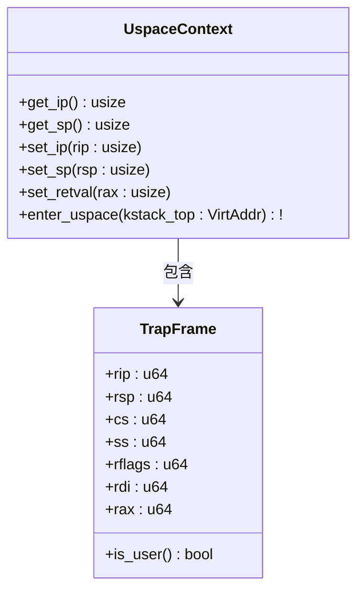
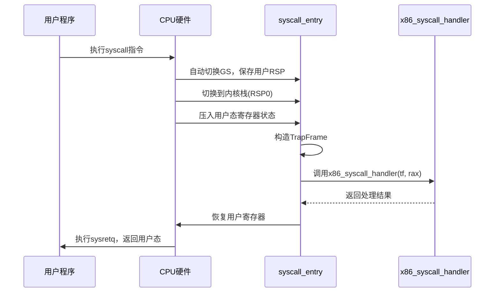
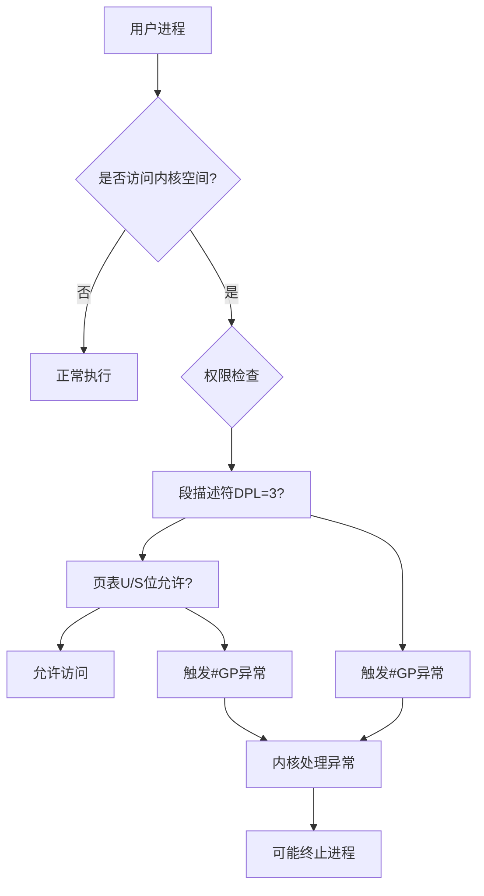

# 用户空间支持

<cite>
**本文档引用的文件**
- [uspace.rs](file://src/x86_64/uspace.rs)
- [syscall.rs](file://src/x86_64/syscall.rs)
- [trap.rs](file://src/x86_64/trap.rs)
- [context.rs](file://src/x86_64/context.rs)
- [gdt.rs](file://src/x86_64/gdt.rs)
- [asm.rs](file://src/x86_64/asm.rs)
- [syscall.S](file://src/x86_64/syscall.S)
- [trap.S](file://src/x86_64/trap.S)
</cite>

## 目录
1. [引言](#引言)
2. [UspaceContext设计与用户态执行环境封装](#uspacecontext设计与用户态执行环境封装)
3. [系统调用接口实现机制](#系统调用接口实现机制)
4. [内核内存管理与权限控制影响](#内核内存管理与权限控制影响)
5. [典型场景分析：用户态切换与异常处理](#典型场景分析用户态切换与异常处理)
6. [多进程操作系统构建意义](#多进程操作系统构建意义)

## 引言
本模块实现了x86_64架构下用户空间（user space）的支持功能，为构建完整的多进程操作系统提供了核心基础设施。通过`UspaceContext`结构体封装用户态进程的执行环境，结合页表隔离、段选择子配置和系统调用门机制，实现了安全的用户态与内核态切换。启用`uspace`特性后，内核能够有效隔离不同进程的地址空间，并在发生缺页异常或系统调用时正确捕获并处理。

**Section sources**
- [uspace.rs](file://src/x86_64/uspace.rs#L1-L108)
- [syscall.rs](file://src/x86_64/syscall.rs#L1-L48)

## UspaceContext设计与用户态执行环境封装

`UspaceContext`是用户态上下文的核心封装结构，基于`TrapFrame`实现，用于保存和恢复用户程序的CPU寄存器状态。该结构体通过设置特定的代码段（CS）和数据段（SS）选择子，确保用户程序运行在Ring 3权限级别，从而实现权限隔离。

在创建新的用户上下文时，`new`方法会初始化指令指针（RIP）、栈指针（RSP）、参数寄存器（RDI）以及标志寄存器（RFLAGS），其中中断使能位（IF）被置位以允许用户态响应中断。关键字段包括：
- `rip`: 用户程序入口地址
- `rsp`: 用户栈顶指针
- `cs`: 使用`GdtStruct::UCODE64_SELECTOR`指向用户代码段
- `ss`: 使用`GdtStruct::UDATA_SELECTOR`指向用户数据段
- `rflags`: 设置中断标志位，禁止IO权限

进入用户态通过`enter_uspace`方法实现，该方法禁用中断后使用`iretq`指令触发模式切换。此过程依赖于之前配置的TSS（任务状态段）中RSP0字段，确保异常发生时能正确切换到内核栈。

**Diagram sources**
- [uspace.rs](file://src/x86_64/uspace.rs#L15-L108)
- [context.rs](file://src/x86_64/context.rs#L15-L30)

**Section sources**
- [uspace.rs](file://src/x86_64/uspace.rs#L15-L108)
- [context.rs](file://src/x86_64/context.rs#L15-L30)

## 系统调用接口实现机制

系统调用通过`syscall`/`sysret`指令对实现高效切换。`init_syscall`函数负责初始化相关MSR寄存器：
- `LSTAR`: 设置系统调用处理程序入口（`syscall_entry`）
- `STAR`: 配置用户/内核代码段和数据段选择子
- `SFMask`: 指定返回时需清除的标志位（如TF、NT等）
- 启用`SYSTEM_CALL_EXTENSIONS`位以激活长模式系统调用

当用户程序执行`syscall`指令时，硬件自动完成以下操作：
1. 切换GS基址（`swapgs`）
2. 保存用户RSP至每CPU变量`__PERCPU_USER_RSP_OFFSET`
3. 切换到TSS中定义的内核栈（RSP0）
4. 压入用户态SS、RSP、RFLAGS、RCX和RIP
5. 跳转到`LSTAR`指定的处理程序

汇编层面的`syscall_entry`标签定义了完整的上下文保存流程，随后调用Rust编写的`x86_syscall_handler`进行实际处理。系统调用号通过RAX传递，参数分别由RDI、RSI、RDX、R10、R8、R9承载（符合x86_64 ABI规范）。处理完成后，`sysretq`指令恢复用户态执行环境。

**Diagram sources**
- [syscall.rs](file://src/x86_64/syscall.rs#L1-L48)
- [syscall.S](file://src/x86_64/syscall.S#L1-L55)

**Section sources**
- [syscall.rs](file://src/x86_64/syscall.rs#L1-L48)
- [syscall.S](file://src/x86_64/syscall.S#L1-L55)

## 内核内存管理与权限控制影响

启用`uspace`特性后，内核必须维护独立的页表结构以实现地址空间隔离。每个`TaskContext`包含`cr3`字段记录进程专属的页目录物理地址。通过`set_page_table_root`方法可在任务切换时更新CR3寄存器，触发TLB刷新，确保地址转换正确性。

权限控制主要通过以下机制实现：
1. **段权限检查**：用户代码段（UCODE64_SELECTOR）和数据段（UDATA_SELECTOR）均设置为DPL=3
2. **页表权限位**：用户可访问页面需设置PTE中的U/S位
3. **TSS机制**：异常发生时自动切换到RSP0内核栈，防止用户态破坏内核栈
4. **GS基址切换**：利用`swapgs`指令快速切换内核与用户态的GS基址

`gdt.rs`中定义的TSS结构体是关键组件，其`privilege_stack_table[0]`存储了Ring 0栈指针（RSP0）。每次异常或系统调用都会使用该值切换到内核栈，保证内核执行环境的安全性。

**Diagram sources**
- [gdt.rs](file://src/x86_64/gdt.rs#L1-L129)
- [context.rs](file://src/x86_64/context.rs#L200-L250)
- [asm.rs](file://src/x86_64/asm.rs#L80-L100)

**Section sources**
- [gdt.rs](file://src/x86_64/gdt.rs#L1-L129)
- [context.rs](file://src/x86_64/context.rs#L200-L250)
- [asm.rs](file://src/x86_64/asm.rs#L80-L10