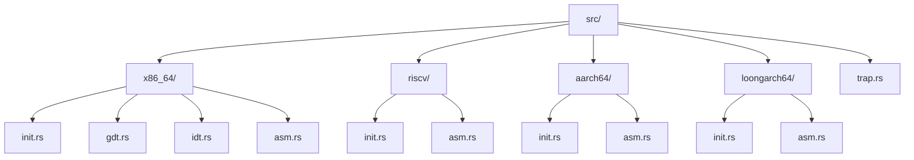
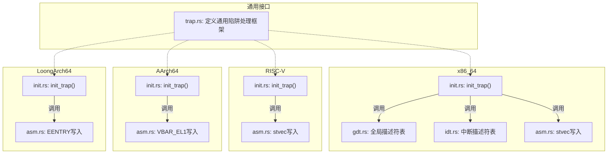

# 系统初始化

<cite>
**本文档引用的文件**  
- [src/x86_64/init.rs](file://src/x86_64/init.rs)
- [src/riscv/init.rs](file://src/riscv/init.rs)
- [src/aarch64/init.rs](file://src/aarch64/init.rs)
- [src/loongarch64/init.rs](file://src/loongarch64/init.rs)
- [src/trap.rs](file://src/trap.rs)
- [src/x86_64/gdt.rs](file://src/x86_64/gdt.rs)
- [src/x86_64/idt.rs](file://src/x86_64/idt.rs)
- [src/riscv/asm.rs](file://src/riscv/asm.rs)
- [src/aarch64/asm.rs](file://src/aarch64/asm.rs)
- [src/loongarch64/asm.rs](file://src/loongarch64/asm.rs)
- [src/x86_64/asm.rs](file://src/x86_64/asm.rs)
</cite>

## 目录
1. [简介](#简介)
2. [项目结构](#项目结构)
3. [核心组件](#核心组件)
4. [架构概览](#架构概览)
5. [详细组件分析](#详细组件分析)
6. [依赖分析](#依赖分析)
7. [性能考虑](#性能考虑)
8. [故障排除指南](#故障排除指南)
9. [结论](#结论)

## 简介
本文档旨在深入分析CPU相关初始化流程，重点描述`init_trap`函数如何在不同架构（x86_64、RISC-V、AArch64、LoongArch64）上设置陷阱向量基址寄存器。文档将解释`init`模块在系统启动早期阶段的关键作用，确保在任何异常发生前完成中断向量表的正确配置。通过对比各架构在初始化过程中的关键差异，提供最佳实践建议，并警告未正确初始化可能导致的系统崩溃问题。

## 项目结构
本项目采用按架构划分的模块化设计，每个子目录对应一种处理器架构（x86_64、riscv、aarch64、loongarch64），并在各自目录中实现独立的初始化逻辑。所有架构共享顶层`trap.rs`定义的通用陷阱处理接口。



**图示来源**
- [src/x86_64/init.rs](file://src/x86_64/init.rs)
- [src/riscv/init.rs](file://src/riscv/init.rs)
- [src/aarch64/init.rs](file://src/aarch64/init.rs)
- [src/loongarch64/init.rs](file://src/loongarch64/init.rs)

**章节来源**
- [src/x86_64/init.rs](file://src/x86_64/init.rs#L1-L38)
- [src/riscv/init.rs](file://src/riscv/init.rs#L1-L13)
- [src/aarch64/init.rs](file://src/aarch64/init.rs#L1-L109)
- [src/loongarch64/init.rs](file://src/loongarch64/init.rs#L1-L49)

## 核心组件
核心组件包括各架构下的`init_trap`函数，负责初始化陷阱向量基址寄存器。此外，x86_64架构还需额外初始化GDT和IDT描述符表。这些组件共同确保系统在启动初期具备完整的异常处理能力。

**章节来源**
- [src/x86_64/init.rs](file://src/x86_64/init.rs#L25-L38)
- [src/riscv/init.rs](file://src/riscv/init.rs#L5-L13)
- [src/aarch64/init.rs](file://src/aarch64/init.rs#L95-L109)
- [src/loongarch64/init.rs](file://src/loongarch64/init.rs#L45-L49)

## 架构概览
系统为每种支持的CPU架构提供了独立但功能对等的初始化路径。尽管底层机制不同，所有架构均通过`init_trap`统一入口完成陷阱向量注册。



**图示来源**
- [src/trap.rs](file://src/trap.rs#L1-L44)
- [src/x86_64/init.rs](file://src/x86_64/init.rs#L25-L38)
- [src/riscv/init.rs](file://src/riscv/init.rs#L5-L13)
- [src/aarch64/init.rs](file://src/aarch64/init.rs#L95-L109)
- [src/loongarch64/init.rs](file://src/loongarch64/init.rs#L45-L49)

## 详细组件分析

### x86_64 架构初始化分析
x86_64架构的初始化最为复杂，需依次执行GDT、IDT及可选的syscall MSR配置。`init_gdt`创建包含TSS的任务状态段并加载至CPU；`init_idt`则从链接脚本提供的`trap_handler_table`填充中断描述符表。

#### 初始化顺序流程图
```mer