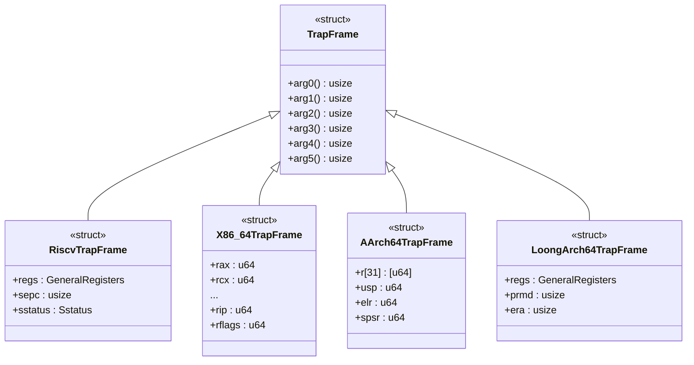

# 陷阱与异常处理

<cite>
**本文档中引用的文件**  
- [trap.rs](file://src/trap.rs)
- [aarch64/context.rs](file://src/aarch64/context.rs)
- [riscv/context.rs](file://src/riscv/context.rs)
- [loongarch64/context.rs](file://src/loongarch64/context.rs)
- [x86_64/context.rs](file://src/x86_64/context.rs)
- [aarch64/trap.rs](file://src/aarch64/trap.rs)
- [riscv/trap.rs](file://src/riscv/trap.rs)
- [loongarch64/trap.rs](file://src/loongarch64/trap.rs)
- [x86_64/trap.rs](file://src/x86_64/trap.rs)
- [x86_64/syscall.rs](file://src/x86_64/syscall.rs)
</cite>

## 目录
1. [简介](#简介)
2. [TrapFrame 结构体：硬件状态的封装](#trapframe-结构体硬件状态的封装)
3. [架构特定的陷阱处理机制](#架构特定的陷阱处理机制)
4. [异常类型解析与分发](#异常类型解析与分发)
5. [分布式中断处理器注册机制](#分布式中断处理器注册机制)
6. [系统调用全流程追踪案例](#系统调用全流程追踪案例)
7. [总结](#总结)

## 简介
本项目实现了一个跨平台的陷阱（Trap）与异常处理框架，支持 x86_64、RISC-V、LoongArch64 和 AArch64 四种主流架构。该框架的核心目标是统一不同架构下 CPU 异常、中断和系统调用的处理流程，提供一个可扩展且高效的异常响应机制。通过 `TrapFrame` 结构体保存 CPU 自动压栈的硬件上下文，并利用 `handle_trap!` 宏将不同类型的陷阱分发到对应的处理函数。特别地，借助 `linkme::distributed_slice` 实现了分布式的中断处理器注册机制，允许用户在任意位置使用 `#[def_trap_handler]` 宏注册自定义处理逻辑。

**Section sources**
- [trap.rs](file://src/trap.rs#L1-L45)

## TrapFrame 结构体：硬件状态的封装
`TrapFrame` 是整个陷阱处理框架的基础数据结构，用于在发生异常或中断时保存 CPU 的当前执行状态。它是一个按 C 语言布局（`#[repr(C)]`）定义的结构体，确保其内存布局与汇编代码中的栈帧完全一致。

每个架构都实现了自己的 `TrapFrame`，但它们都提供了统一的接口来访问通用寄存器和程序计数器。例如，在 RISC-V 架构中，`TrapFrame` 包含 `regs`（通用寄存器）、`sepc`（异常程序计数器）和 `sstatus`（状态寄存器）；而在 x86_64 架构中，则包含 `rax`, `rbx` 等通用寄存器以及 `rip`（指令指针）、`rflags`（标志寄存器）等。

所有架构的 `TrapFrame` 都实现了 `arg0()` 到 `arg5()` 方法，用于获取系统调用的前六个参数。这些方法屏蔽了底层架构的差异，为上层系统调用处理提供了统一的接口。

**Diagram sources**
- [riscv/context.rs](file://src/riscv/context.rs#L100-L115)
- [x86_64/context.rs](file://src/x86_64/context.rs#L15-L95)
- [aarch64/context.rs](file://src/aarch64/context.rs#L15-L55)
- [loongarch64/context.rs](file://src/loongarch64/context.rs#L80-L100)

**Section sources**
- [riscv/context.rs](file://src/riscv/context.rs#L100-L115)
- [x86_64/context.rs](file://src/x86_64/context.rs#L15-L95)
- [aarch64/context.rs](file://src/aarch64/context.rs#L15-L55)
- [loongarch64/context.rs](file://src/loongarch64/context.rs#L80-L100)

## 架构特定的陷阱处理机制
尽管顶层 API 统一，但每种架构的陷阱入口点和处理流程都有所不同，这主要体现在各自的 `trap.S` 汇编文件和 `trap.rs` 模块中。

### 入口点
所有架构的陷阱处理都始于一个名为 `xxx_trap_handler` 的无符号（`no_mangle`）函数，该函数由汇编代码调用。例如：
- **AArch64**: `handle_sync_exception` 处理同步异常，`handle_irq_exception` 处理 IRQ。
- **RISC-V**: `riscv_trap_handler` 是唯一的入口，根据 `scause` 寄存器判断异常类型。
- **LoongArch64**: `loongarch64_trap_handler` 根据 `estat` 寄存器的 `cause` 字段进行分发。
- **x86_64**: `x86_trap_handler` 使用 `tf.vector` 来区分不同的异常向量。

### 上下文切换
当陷阱发生时，汇编代码首先保存必要的寄存器到 `TrapFrame` 中，然后跳转到上述的 Rust 处理函数。处理完成后，通常会更新 `TrapFrame` 中的程序计数器（如 `sepc`, `elr`, `era`, `rip`），以控制返回后的执行位置。

**Section sources**
- [aarch64/trap.rs](file://src/aarch64/trap.rs#L50-L120)
- [riscv/trap.rs](file://src/riscv/trap.rs#L40-L78)
- [loongarch64/trap.rs](file://src/loongarch64/trap.rs#L40-L73)
- [x86_64/trap.rs](file://src/x86_64/trap.rs#L30-L92)

## 异常类型解析与分发
框架能够识别多种类型的异常，并将其分发到相应的处理函数。

### 页面错误 (Page Fault)
当发生页面错误时，各架构会解析错误码以确定访问权限（读、写、执行）和访问者模式（用户态/内核态）。例如：
- **x86_64**: 通过 `cr2()` 寄存器获取出错的虚拟地址，并调用 `err_code_to_flags` 将 `error_code` 转换为 `PageFaultFlags`。
- **RISC-V**: 根据 `scause` 的具体值（Load/Store/Instruction Page Fault）直接确定访问类型。
- **AArch64**: 从 `ESR_EL1` 寄存器提取 ISS（Instruction Specific Syndrome）字段来判断访问类型。

最终，所有架构都会调用 `handle_trap!(PAGE_FAULT, vaddr, access_flags, is_user)` 宏来触发页面错误处理链。

### 中断请求 (IRQ)
对于外部中断，框架同样使用 `handle_trap!` 宏进行分发。中断号的来源因架构而异：
- **x86_64**: 中断号来自 `tf.vector`。
- **RISC-V**: 中断号隐含在 `scause` 中，