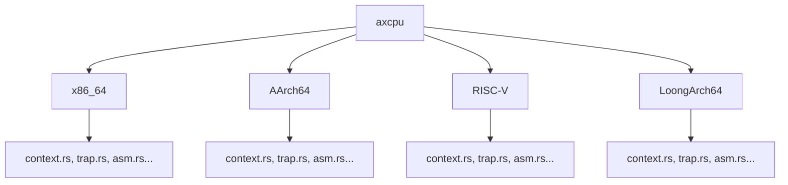

# 项目简介

<cite>
**本文档引用的文件**
- [README.md](file://README.md)
- [Cargo.toml](file://Cargo.toml)
- [src/lib.rs](file://src/lib.rs)
- [src/x86_64/mod.rs](file://src/x86_64/mod.rs)
- [src/aarch64/mod.rs](file://src/aarch64/mod.rs)
- [src/riscv/mod.rs](file://src/riscv/mod.rs)
- [src/loongarch64/mod.rs](file://src/loongarch64/mod.rs)
- [src/x86_64/context.rs](file://src/x86_64/context.rs)
- [src/aarch64/context.rs](file://src/aarch64/context.rs)
- [src/riscv/context.rs](file://src/riscv/context.rs)
- [src/loongarch64/context.rs](file://src/loongarch64/context.rs)
</cite>

## 目录
1. [引言](#引言)
2. [项目定位与核心价值](#项目定位与核心价值)
3. [架构支持与抽象设计](#架构支持与抽象设计)
4. [功能特性与编译开关](#功能特性与编译开关)
5. [技术实现概览](#技术实现概览)
6. [维护信息与许可证](#维护信息与许可证)

## 引言

`axcpu` 是一个为操作系统内核提供 CPU 特权指令与结构抽象的核心 Rust 库。该项目旨在构建跨平台硬件抽象层（HAL），使上层操作系统代码能够以统一的方式访问底层 CPU 功能，而无需关心具体架构的差异。它被设计用于 ArceOS 等微内核操作系统中，作为连接硬件与系统服务的关键桥梁。

本项目通过为多种主流 CPU 架构提供一致的编程接口，极大地简化了操作系统的可移植性开发工作。其无标准库（no-std）的设计使其能够在资源受限的裸机环境中运行，是现代安全、模块化操作系统内核的重要组成部分。

## 项目定位与核心价值

`axcpu` 的核心作用是作为操作系统内核中的 CPU 抽象层，屏蔽不同处理器架构在特权级操作、中断处理、上下文切换等方面的底层差异。对于像 ArceOS 这样的微内核系统而言，`axcpu` 提供了稳定、高效的硬件交互基础，使得内核可以在 x86_64、AArch64、RISC-V 和 LoongArch64 等多种架构上无缝运行。

该项目的价值体现在：
- **统一接口**：为不同架构提供一致的 API，降低跨平台开发复杂度。
- **高性能**：直接操作硬件寄存器和汇编指令，确保最小的运行时开销。
- **安全性**：通过类型安全的 Rust 接口封装危险的底层操作，减少错误风险。
- **模块化**：采用条件编译和功能开关，允许根据目标平台灵活裁剪功能。

**Section sources**
- [README.md](file://README.md#L0-L14)
- [Cargo.toml](file://Cargo.toml#L1-L61)

## 架构支持与抽象设计

`axcpu` 当前支持四种主流 CPU 架构：
- x86_64
- AArch64
- RISC-V
- LoongArch64

项目通过在 `src` 目录下为每种架构建立独立的子模块（如 `x86_64/`, `aarch64/` 等），并在根模块 `lib.rs` 中使用 `cfg_if!` 宏根据目标架构选择性地导出对应模块的符号，实现了优雅的多架构支持。

**Diagram sources**
- [src/lib.rs](file://src/lib.rs#L7-L28)
- [src/x86_64/mod.rs](file://src/x86_64/mod.rs#L0-L20)
- [src/aarch64/mod.rs](file://src/aarch64/mod.rs#L0-L12)
- [src/riscv/mod.rs](file://src/riscv/mod.rs#L0-L13)
- [src/loongarch64/mod.rs](file://src/loongarch64/mod.rs#L0-L13)

每个架构模块都实现了关键的数据结构抽象，主要包括：
- **TrapFrame**：保存发生中断或异常时的 CPU 寄存器状态。
- **TaskContext**：保存任务切换时需要保存的上下文，包括栈指针、线程指针和扩展状态（如浮点寄存器）。
- **上下文切换机制**：通过内联汇编实现高效的任务切换函数 `context_switch`。

这些抽象使得上层调度器可以以相同的方式管理不同架构下的任务执行流。

**Section sources**
- [src/lib.rs](file://src/lib.rs#L7-L28)
- [src/x86_64/context.rs](file://src/x86_64/context.rs#L0-L290)
- [src/aarch64/context.rs](file://src/aarch64/context.rs#L0-L267)
- [src/riscv/context.rs](file://src/riscv/context.rs#L0-L335)
- [src/loongarch64/context.rs](file://src/loongarch64/context.rs#L0-L265)

## 功能特性与编译开关

`axcpu` 通过 Cargo 的 feature 机制提供了灵活的功能配置选项，开发者可以根据实际需求启用或禁用特定功能：

| Feature 名称 | 描述 |
|--------------|------|
| fp-simd      | 启用对浮点和 SIMD 寄存器的保存与恢复支持，用于需要数学计算的应用场景 |
| uspace       | 启用用户空间支持，包括页表切换、系统调用处理等，适用于完整操作系统 |
| tls          | 支持线程局部存储（Thread Local Storage）的上下文管理 |
| arm-el2      | 为 AArch64 架构提供 EL2 模式支持（实验性） |

例如，在支持用户进程的操作系统中，通常会同时启用 `uspace` 和 `fp-simd` 特性，以确保用户程序的正确执行和性能表现。

此外，`axcpu` 严格遵循 `no-std` 原则，不依赖于 Rust 标准库，仅使用 `core` 和 `alloc` 等基本 crate，这使其非常适合在操作系统内核等低层级环境中使用。

**Section sources**
- [Cargo.toml](file://Cargo.toml#L20-L24)
- [src/x86_64/mod.rs](file://src/x86_64/mod.rs#L10-L15)
- [src/aarch64/mod.rs](file://src/aarch64/mod.rs#L6-L9)
- [src/riscv/mod.rs](file://src/riscv/mod.rs#L8-L11)
- [src/loongarch64/mod.rs](file://src/loongarch64/mod.rs#L8-L11)

## 技术实现概览

`axcpu` 的技术实现围绕两个核心概念展开：**上下文管理** 和 **陷阱处理**。

### 上下文管理

`TaskContext` 结构体是上下文管理的核心。它在不同架构下定义了相应的字段来保存任务的状态，包括：
- 栈指针（sp）
- 返回地址（ra）
- 调用者保存的寄存器
- 扩展状态（如浮点寄存器）
- 页表根地址（用于虚拟内存管理）

`switch_to` 方法负责执行实际的上下文切换，先保存当前任务状态，再加载下一个任务的状态，并通过内联汇编跳转到新任务的执行位置。

### 陷阱处理

`trap.rs` 文件定义了统一的陷阱处理框架。当发生中断、异常或系统调用时，CPU 会跳转到预设的陷阱处理程序。`axcpu` 