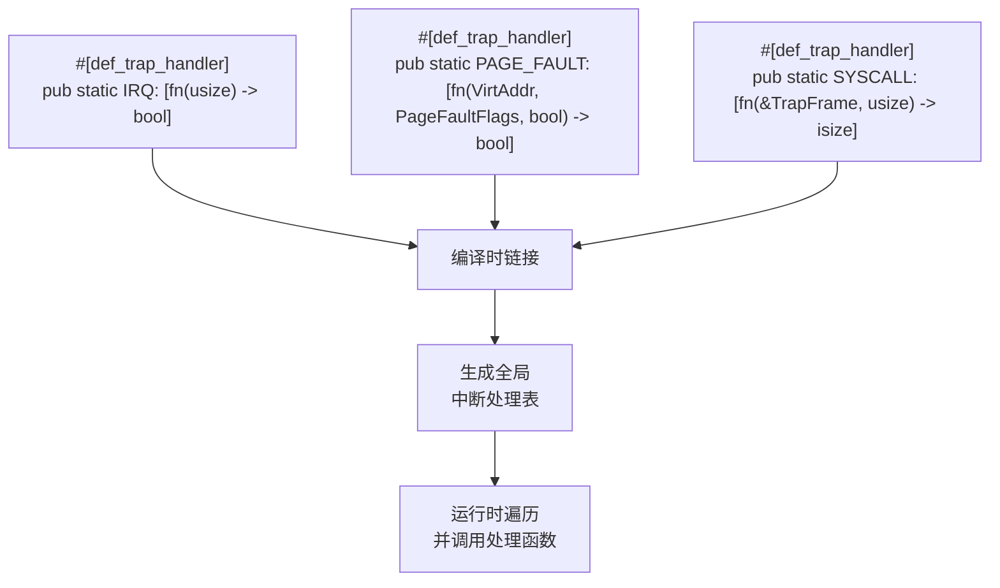
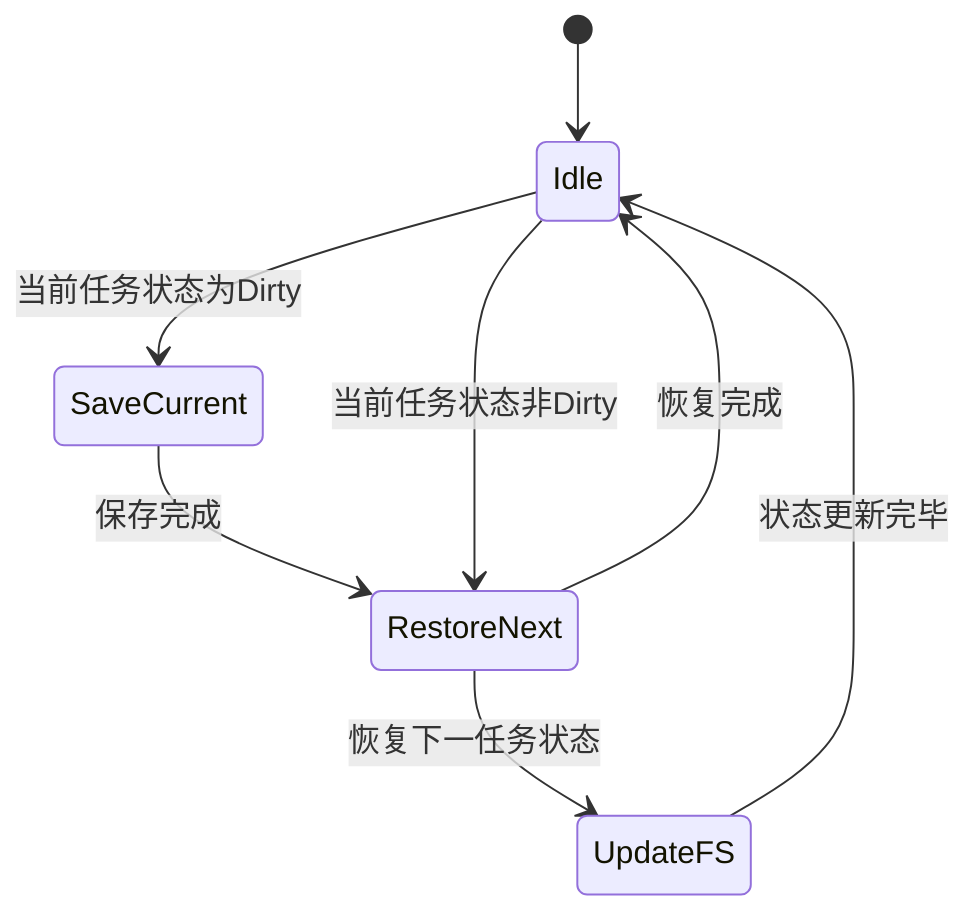
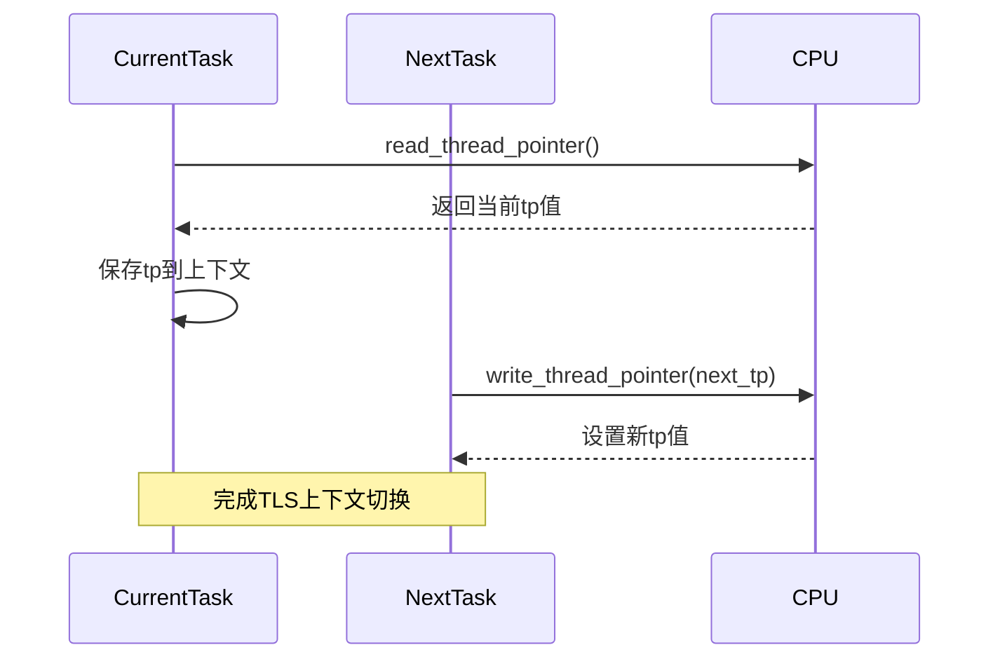
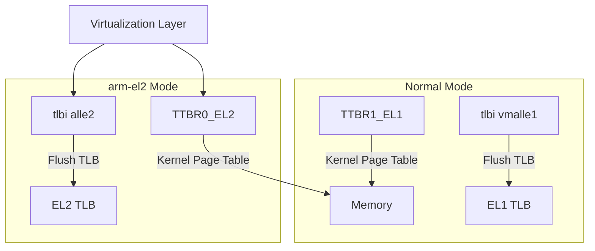

# 高级特性与扩展

<cite>
**Referenced Files in This Document **  
- [trap.rs](file://src/trap.rs)
- [riscv/context.rs](file://src/riscv/context.rs)
- [aarch64/init.rs](file://src/aarch64/init.rs)
- [aarch64/asm.rs](file://src/aarch64/asm.rs)
- [x86_64/context.rs](file://src/x86_64/context.rs)
- [aarch64/context.rs](file://src/aarch64/context.rs)
- [loongarch64/context.rs](file://src/loongarch64/context.rs)
</cite>

## Table of Contents
1. [#[def_trap_handler]宏的实现原理](#def_trap_handler宏的实现原理)  
2. [fp-simd特性：浮点与SIMD寄存器状态管理](#fp-simd特性浮点与simd寄存器状态管理)  
3. [tls特性：线程本地存储支持机制](#tls特性线程本地存储支持机制)  
4. [arm-el2特性：ARM虚拟化环境中的特殊用途](#arm-el2特性arm虚拟化环境中的特殊用途)  
5. [扩展TrapFrame字段与添加新中断类型](#扩展trapframe字段与添加新中断类型)

## #[def_trap_handler]宏的实现原理

`#[def_trap_handler]`宏是axcpu框架中用于定义分散式中断处理器注册的核心机制。该宏通过利用`linkme`库的`distributed_slice`功能，实现了在编译时将中断处理函数分散注册到全局静态切片中的能力。

在`src/trap.rs`文件中，通过`pub use linkme::distributed_slice as def_trap_handler;`将`linkme`的分布式切片功能重命名为`def_trap_handler`，从而创建了自定义宏。随后，框架定义了多个使用该宏的静态切片，如`IRQ`、`PAGE_FAULT`和`SYSCALL`，分别用于注册中断请求、页面错误和系统调用的处理函数。

**Diagram sources **  
- [trap.rs](file://src/trap.rs#L0-L43)

**Section sources**  
- [trap.rs](file://src/trap.rs#L0-L43)

## fp-simd特性：浮点与SIMD寄存器状态管理

`fp-simd`特性为科学计算类应用提供了关键的浮点和SIMD（单指令多数据）寄存器状态保存与恢复功能。当启用此特性时，系统能够在上下文切换和异常处理过程中正确地保存和恢复浮点运算单元的状态，确保数值计算的连续性和准确性。

在RISC-V架构中，`FpState`结构体定义了浮点寄存器状态，包括32个64位浮点寄存器和一个控制状态寄存器。通过`#[cfg(feature = "fp-simd")]`条件编译，系统在任务上下文切换时会调用`switch_to`方法，根据当前任务的浮点状态（Clean、Initial或Dirty）决定是否需要保存当前状态，并恢复下一个任务的状态。

**Diagram sources **  
- [riscv/context.rs](file://src/riscv/context.rs#L56-L98)

**Section sources**  
- [riscv/context.rs](file://src/riscv/context.rs#L56-L98)
- [aarch64/context.rs](file://src/aarch64/context.rs#L78-L141)
- [loongarch64/context.rs](file://src/loongarch64/context.rs#L106-L189)
- [x86_64/context.rs](file://src/x86_64/context.rs#L151-L254)

## tls特性：线程本地存储支持机制

`tls`特性实现了线程本地存储（Thread Local Storage）的支持机制，允许每个线程拥有独立的数据副本。该机制通过架构特定的线程指针寄存器来实现，如x86_64的`fs_base`、AArch64的`tpidr_el0`和LoongArch64的`tp`。

在任务上下文切换时，系统会保存当前任务的线程指针，并恢复下一个任务的线程指针。这种机制对于实现线程局部变量、避免数据竞争至关重要。例如，在x86_64架构中，`TaskContext`结构体包含`fs_base`字段，`switch_to`方法在切换时会调用`read_thread_pointer`和`write_thread_pointer`来保存和恢复线程指针。

**Diagram sources **  
- [x86_64/context.rs](file://src/x86_64/context.rs#L215-L254)
- [aarch64/context.rs](file://src/aarch64/context.rs#L140-L175)
- [loongarch64/context.rs](file://src/loongarch64/context.rs#L153-L189)
- [riscv/context.rs](file://src/riscv/context.rs#L187-L229)

**Section sources**  
- [x86_64/context.rs](file://src/x86_64/context.rs#L151-L254)
- [aarch64/context.rs](file://src/aarch64/context.rs#L96-L175)
- [loongarch64/context.rs](file://src/loongarch64/context.rs#L106-L189)
- [riscv/context.rs](file://src/riscv/context.rs#L136-L229)

## arm-el2特性：ARM虚拟化环境中的特殊用途

`arm-el2`特性专为ARM虚拟化环境设计，主要用于在EL2（Hypervisor模式）下运行内核。当启用此特性时，系统会调整一系列硬件寄存器的访问方式，以适应虚拟化环境的需求。

在AArch64架构中，`arm-el2`特性影响了页表根寄存器、TLB刷新指令和异常向量基址寄存器的使用。例如，`read_kernel_page_table`函数在启用`arm-el2`时会读取`TTBR0_EL2`而非`TTBR1_EL1`，因为EL2下的内核空间页表使用`TTBR0_EL2`。同样，`flush_tlb`函数会使用`tlbi vae2is`和`tlbi alle2`指令来刷新EL2的TLB。

**Diagram sources **  
- [aarch64/asm.rs](file://src/aarch64/asm.rs#L123-L166)
- [aarch64/asm.rs](file://src/aarch64/asm.rs#L161-L202)

**Section sources**  
- [aarch64/init.rs](file://src/aarch64/init.rs#L0-L109)
- [aarch64/asm.rs](file://src/aarch64/asm.rs#L0-L203)

## 扩展TrapFrame字段与添加新中断类型

为了保持跨架构兼容性，扩展`TrapFrame`字段和添加新的中断类型需要遵循统一的设计模式。首先，应在`src/trap.rs`中定义新的中断处理静态切片，然后在各架构的`context.rs`文件中相应地扩展`TrapFrame`结构体。

例如，要添加一个新的中断类型`CUSTOM_IRQ`，可以在`trap.rs`中添加`#[def_trap_handler] pub static CUSTOM_IRQ: [fn(usize) -> bool];`。接着，在每个架构的`TrapFrame`定义中添加必要的寄存器字段。最后，修改相应的汇编代码（如`trap.S`）以在中断发生时正确保存和恢复这些新字段。

这种分散式注册机制确保了新中断类型的处理函数可以在编译时被正确链接，而无需修改核心中断分发逻辑。同时，通过条件编译特性，可以灵活地启用或禁用特定的中断处理功能，保持代码的模块化和可维护性。

**Section sources**  
- [trap.rs](file://src/trap.rs#L0-L43)
- [x86_64/context.rs](file://src/x86_64/context.rs#L0-L62)
- [aarch64/context.rs](file://src/aarch64/context.rs#L0-L49)
- [riscv/context.rs](file://src/riscv/context.rs#L97-L140)
- [loongarch64/context.rs](file://src/loongarch64/context.rs#L0-L46)